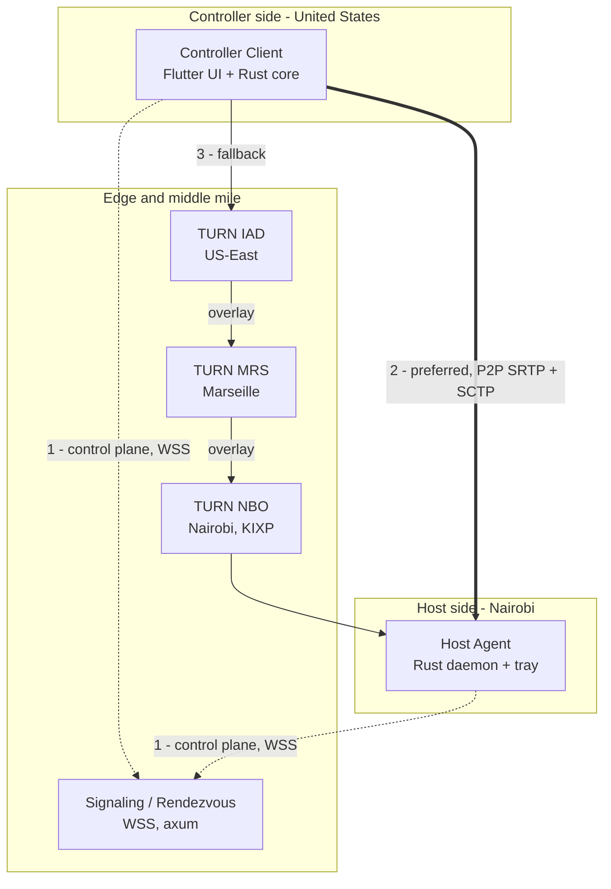
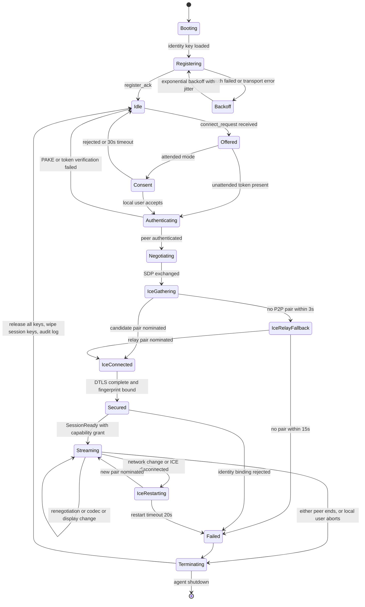
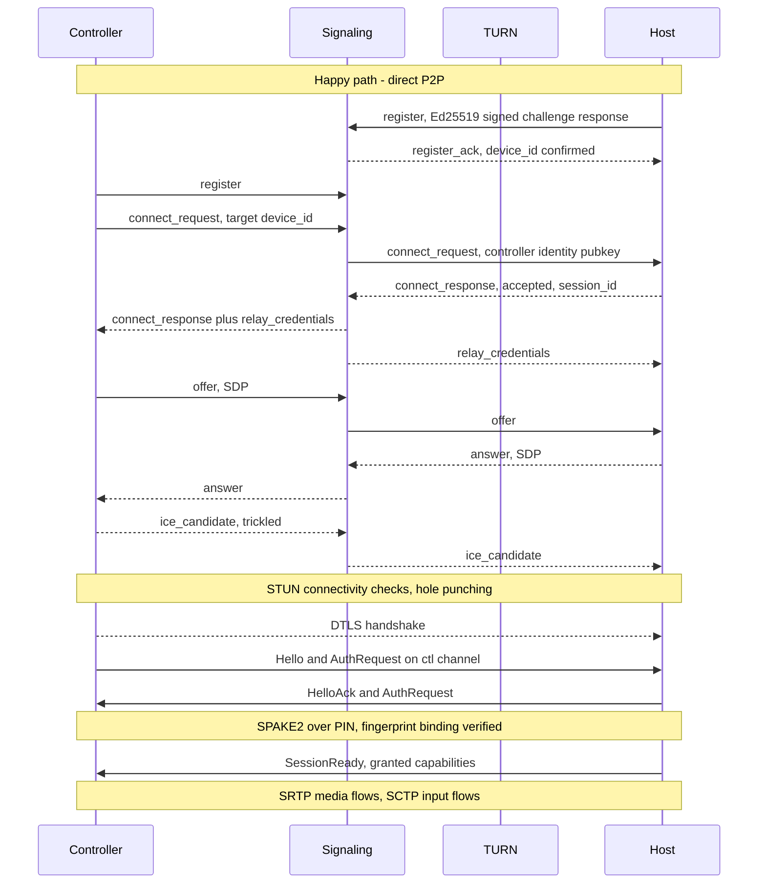
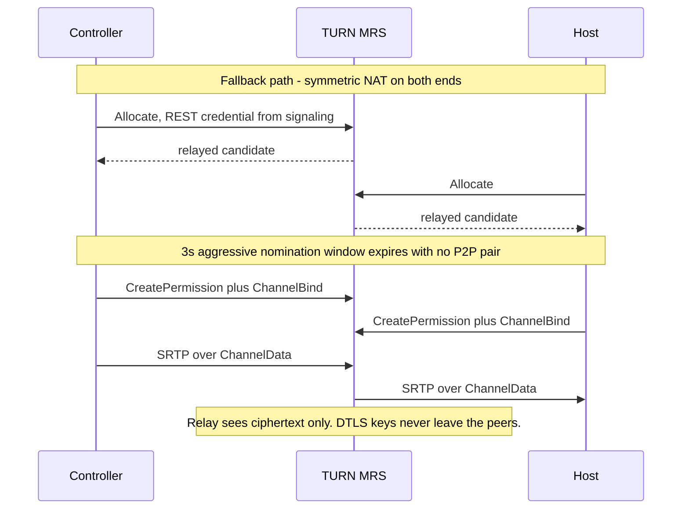
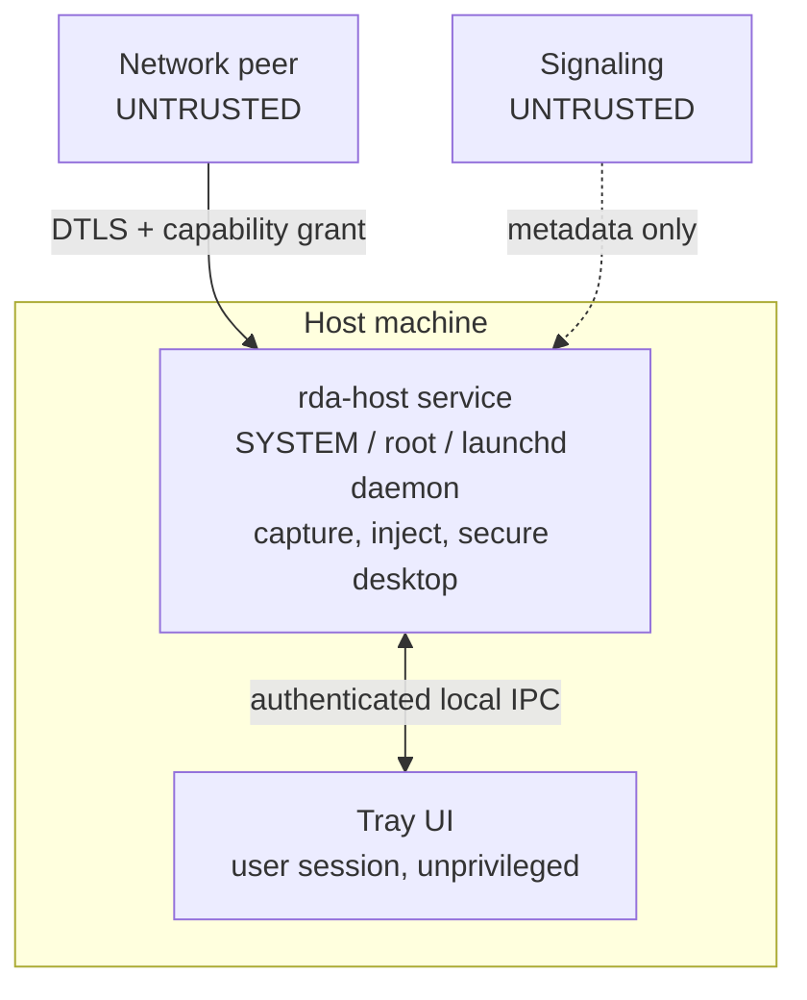

# Architecture — Remote Desktop Engine

A production-grade, open-source remote access system (AnyDesk / RustDesk class) built on a Rust core with a
Flutter UI, transporting screen, audio and input over native WebRTC. The defining constraint is not throughput
and not CPU: it is **distance**. The primary corridor is USA ↔ Nairobi, Kenya — 180–250 ms RTT, jitter-prone,
with non-trivial packet loss on the last mile. Every decision in this document is justified against that path,
not against a LAN. A design that is correct at 5 ms RTT is frequently *wrong* at 220 ms, and the two most
important examples — retransmission policy and keyframe recovery — are inverted relative to the defaults
shipped by every WebRTC stack.

**Status:** Phase 1 — design. No implementation exists yet.
**Codename used throughout:** `rda` (remote desktop agent).

---

## Design Principles

These are binding rules for Phases 2–6. Where a later phase wants to violate one, it must amend this document.

1. **A round trip is a budget you spend once.** Every mechanism that costs an RTT — a NACK, a DCEP channel
   open, an extra signaling exchange, a renegotiation — must justify itself against a 220 ms price tag.
   *Consequence:* channels are pre-negotiated, handshakes are batched, and recovery is designed to avoid
   asking the sender for anything.
2. **Prefer redundancy over retransmission.** At 220 ms RTT a retransmitted packet arrives ~7 frames late at
   30 fps. *Consequence:* FEC and loss-tolerant encoding carry the resilience load; NACK is a narrow special
   case reserved for reference frames.
3. **Never let one loss stall the stream.** The receiver must always be able to decode *something*.
   *Consequence:* temporal-layer SVC plus per-frame dependency signalling, so undecodable frames are skipped
   rather than blocking the pipeline.
4. **Never answer loss with a keyframe if a reference will do.** IDR frames are 15–30× a P frame and cause the
   congestion spiral they were meant to fix. *Consequence:* acknowledged long-term reference frames and
   LTR-based recovery are the primary repair path; IDR is the fallback of last resort and is paced.
5. **Input is not video and must not share its fate.** *Consequence:* input rides separate SCTP streams with
   per-class reliability, and is never queued behind a video burst.
6. **Key identity is HID, not characters and not platform keycodes.** *Consequence:* the wire format carries
   USB HID usage IDs, with a separate Unicode path for IME and dead keys.
7. **Assume every packet is hostile and every relay is compromised.** *Consequence:* the DTLS fingerprint is
   cryptographically bound to a device identity key, the deserializer is bounds-checked and fuzzed, and the
   signaling server is never trusted with session content.
8. **The local human always wins.** *Consequence:* physical input at the host preempts remote input, the
   session indicator cannot be suppressed, and disconnect is always one action away.
9. **Degrade continuously, never cliff.** *Consequence:* an explicit ordered degradation ladder with defined
   triggers, rather than emergent behaviour from the encoder and BWE arguing with each other.
10. **Measure everything, from day one.** *Consequence:* telemetry (RTT, loss, jitter, frame drops, queue
    depth, encode time) is a Phase 2 deliverable, not a Phase 6 afterthought.

---

## At a Glance



**Headline number.** Glass-to-glass video latency on a healthy 220 ms RTT path: **≈ 170 ms typical**
(124 ms best case, 313 ms degraded). Motion-to-photon for the operator — the delay between moving the mouse
and seeing the cursor move on the remote desktop — is **≈ 290 ms typical**, because that path costs a *full*
round trip plus host repaint. No amount of engineering removes the ~118 ms RTT floor imposed by the speed of
light in fiber over the New York–Nairobi geodesic. What engineering *can* remove is everything else, and the
difference between a competent and an incompetent implementation on this corridor is roughly 300 ms.

---

## 1. System Components & Session Lifecycle

### 1.1 Components

| Component | Runtime | Responsibility | Trust |
|---|---|---|---|
| **Controller Client** | Flutter UI + Rust core via FFI | Renders remote screen, captures local input, drives the peer connection | Trusted by its own user only |
| **Host Agent** | Headless Rust daemon/service + small tray UI in the user session | Captures screen/audio, injects input, enforces authorization | Owns the crown jewels |
| **Signaling / Rendezvous** | Rust, axum + tokio, WSS | Device registry, presence, offer/answer/ICE relay, TURN credential minting | **Untrusted** with session content |
| **STUN servers** | coturn | Server-reflexive candidate discovery | Untrusted |
| **TURN relays** | coturn | Media relay when P2P fails | **Untrusted** — sees ciphertext only |
| **Overlay relay mesh** *(optional)* | Custom Rust | Controls the middle mile between our own PoPs | Untrusted, same as TURN |

Three components the brief did not list, which are nonetheless required:

- **Device registry.** Presence alone is insufficient; we need a durable mapping of device ID → identity public
  key → address book membership → unattended-access policy. Folding this into the signaling process is
  acceptable at first but it is a distinct concern with distinct storage.
- **Relay-selection oracle.** Clients cannot sensibly rank PoPs on their own without measurement. A small
  service that maintains an inter-PoP latency matrix and returns a ranked ICE server list per client geography
  turns relay selection from guesswork into arithmetic. See §1.4.
- **Update service.** A remote-access agent with a persistent privileged service is a high-value target. Signed,
  verifiable, staged auto-update is a security requirement, not a convenience feature.

### 1.2 Session Lifecycle



Two transitions carry more weight than the rest:

- **`Terminating` must always release all keys.** Session teardown while a modifier is held leaves the host with
  a stuck Ctrl or Alt. This is a real, common, user-visible bug in shipped products. It is handled here as a
  mandatory state action, not as best-effort cleanup. See §4.4.
- **`Streaming → IceRestarting`** is expected, not exceptional. Mobile-tethered and residential Kenyan
  connections change NAT bindings frequently. ICE restart must preserve the authenticated session — we do not
  re-run the PAKE, we re-bind the new DTLS fingerprint using the already-established identity keys.

### 1.3 Connection Establishment





`ChannelBind` matters here: TURN ChannelData framing costs 4 bytes of overhead versus 36 bytes for a full
STUN Send indication. On a relayed 6 Mbps stream that is a real saving, and it is frequently left on the table.

### 1.4 The US ↔ Kenya Corridor

This is the part of the topology that must be measured rather than assumed.

**How the traffic actually flows.** Kenya's international capacity lands at Mombasa, served by SEACOM, TEAMS,
EASSy, LION2, DARE1, PEACE, and 2Africa, with further systems landing before 2027. The critical fact for our
PoP placement is the *northern* leg: SEACOM and PEACE both run Mombasa → Red Sea → Suez → Mediterranean →
**Marseille**, and PEACE's main trunk explicitly terminates in France with a Mediterranean segment through
Egypt, Cyprus and Malta. Traffic from Nairobi to a US endpoint therefore overwhelmingly transits **Europe**,
and most commonly the Marseille–London–Amsterdam triangle, before crossing the Atlantic.

**Johannesburg is not the midpoint — and this is the expensive mistake to avoid.** Placing a relay in South
Africa for a US ↔ Nairobi session is intuitive on a map and wrong on the network. Nairobi → Johannesburg has
historically been routed *via Europe* on many carriers, meaning a JNB relay can add a full Europe round trip
rather than removing one. EASSy and the DARE1 South Africa extension have improved direct east-coast capacity,
but the routing is carrier-dependent and must be measured per-provider before JNB is trusted. **Default to
European PoPs. Treat JNB as a measurement-gated option, never an assumption.**

**Latency estimates** (engineering estimates, to be replaced by measurement in Phase 6):

| Leg | Distance (approx) | RTT estimate | Notes |
|---|---|---|---|
| New York ↔ Nairobi, great circle | ~11,840 km | **~118 ms theoretical floor** | Fiber at ~200,000 km/s |
| US-East ↔ London / Amsterdam | ~5,600 km | 70–85 ms | Dense, well-provisioned |
| Marseille ↔ Nairobi | ~6,400 km via Suez | 85–110 ms | Cable-dependent; Red Sea disruptions have real impact |
| US-East ↔ Nairobi, observed end-to-end | — | **180–250 ms** | Matches the stated project constraint |
| Nairobi metro, KIXP-peered | — | 2–15 ms | Only if both peers are Kenyan and peer at KIXP |
| Nairobi → non-peered local ISP | — | 40–180 ms | Trombones through Europe when peering is absent |

That last row is the sleeper. Two Kenyan endpoints on different ISPs that do not peer at KIXP may route to each
other **via London**. An in-country TURN PoP in Nairobi is therefore not only about US↔KE sessions; it fixes a
pathological KE↔KE case that would otherwise be 20× worse than it should be.

**Cloud presence near Nairobi (verified, August 2026).** AWS operates **Local Zones in Nairobi** (since 2024)
and added an **AWS Direct Connect location in Nairobi in September 2025**; a full AWS region for Kenya with
three Availability Zones was announced in September 2025 and is targeted for **late 2026** — it is not
generally available today, so do not architect as though it is. Microsoft has announced a Kenyan data centre
investment but Azure's African regions remain **South Africa North/West**; Google Cloud's African region is
**`africa-south1` (Johannesburg)** with a Nairobi interconnect site but no Kenyan region. The practical
conclusion: for in-country presence *today*, use carrier-neutral colocation — **iColo** or **Africa Data
Centres** — peered at **KIXP**, not a hyperscaler region.

**Recommended PoP list:**

| PoP | Location | Roles | Rationale |
|---|---|---|---|
| `IAD` | US-East, Ashburn | Signaling, STUN, TURN, overlay ingress | Controller-side ingress; cheap, dense |
| `MRS` | Marseille | Signaling, STUN, TURN, overlay | The real midpoint. PEACE/SEACOM Mediterranean landing |
| `LHR` or `AMS` | London / Amsterdam | Signaling, STUN, TURN | Secondary European path; peering depth |
| `NBO` | Nairobi, iColo or ADC, KIXP-peered | STUN, TURN, overlay egress | In-country; fixes KE↔KE trombone, best host-side ingress |
| `JNB` | Johannesburg | TURN, optional | **Enable only if measurement proves a direct NBO↔JNB path** |

**Relay-selection algorithm:**

1. On agent start (and every 15 min), both peers UDP-probe every PoP's STUN endpoint five times and record the
   median RTT. Cheap: five 20-byte packets per PoP.
2. Peers report their PoP latency vector to the signaling server on `register`.
3. The oracle holds an inter-PoP latency matrix (measured server-side, continuously). For a session it selects
   the PoP minimising `rtt_controller_to_pop + rtt_pop_to_host`, and for the overlay case the pair
   `(ingress, egress)` minimising `rtt_c_to_in + overlay(in, eg) + rtt_eg_to_h`.
4. `relay_credentials` returns the ranked list. **The client gathers relay candidates from the top two PoPs
   only** — every additional relay candidate multiplies the ICE check matrix and directly delays connection on
   a 220 ms path, where each check round is a fifth of a second.
5. Fallback order: host/srflx pairs → best relay → second relay → TURN/TLS on 443 (for restrictive networks) →
   fail.

### 1.5 The Private Overlay Relay Mesh

Standard TURN gives exactly **one** relay hop, which means the middle mile is whatever BGP hands you. On the
Europe–East Africa corridor, transit quality varies enough between providers that this is worth attacking.

The design: the client allocates on a TURN server near *itself* (`IAD`); that server forwards over **our own
inter-PoP transport** to an egress node near the host (`NBO`), which delivers to the host. The overlay hop can
use a premium backbone, its own pacing, and its own FEC across the segment we control.

- **When it wins:** relayed sessions where the public path between regions is congested or badly peered — most
  commonly evening-peak Kenyan residential traffic. Also whenever we can buy better transit between our own
  PoPs than the default path.
- **When it is wasted money:** the majority of sessions, which get a direct P2P pair and never touch a relay at
  all. Also same-region sessions. The overlay is justified by the relayed tail, not the median.
- **How it degrades:** the ingress node is a fully standards-compliant TURN server. The second hop is an
  internal implementation detail — the ICE agent sees exactly one relay candidate and is unaware of the
  overlay. If the overlay link is unhealthy the ingress node simply forwards over the public path instead. This
  property is non-negotiable: **the overlay must never require a non-standard client.**

The correctness constraint: TURN allocation semantics must be preserved end-to-end. The egress node's address
is what the peer sees, so permissions and channel bindings must be maintained at the egress, and the
ingress/egress pair must behave as one logical TURN server for the lifetime of the allocation.

### 1.6 Repository Layout

```
rda/
├── Cargo.toml                    # workspace root
├── crates/
│   ├── rda-core/                 # session state machine, capability model, config. No I/O.
│   ├── rda-proto/                # wire types, codecs, validation. THE single source of truth for PROTOCOL.md.
│   │   └── fuzz/                 # cargo-fuzz targets: control frame, SDP, signaling JSON
│   ├── rda-transport/            # webrtc peer connection, ICE policy, data channels, BWE glue
│   ├── rda-signal-client/        # WSS client, reconnect, backoff
│   ├── rda-capture/              # screen + audio capture trait
│   │   ├── src/windows/          # cfg(windows)  — DXGI DDA + WGC
│   │   ├── src/macos/            # cfg(target_os="macos") — ScreenCaptureKit
│   │   └── src/linux/            # cfg(target_os="linux") — PipeWire + portal
│   ├── rda-encode/               # NV12 conversion, hw encoder abstraction, rate control
│   ├── rda-decode/               # hw decode + fallback
│   ├── rda-input/                # HID mapping, injection backends, reconciliation
│   ├── rda-crypto/               # identity keys, PAKE, token issue/verify, keychain storage
│   ├── rda-telemetry/            # metrics, structured tracing, session recorder
│   ├── rda-host/                 # Host Agent binary: daemon/service + tray
│   ├── rda-ffi/                  # cdylib for Flutter. flutter_rust_bridge boundary. No business logic.
│   └── rda-signal-server/        # axum signaling + registry + relay oracle
├── app/                          # Flutter application
│   ├── lib/
│   └── rust_builder/
├── deploy/                       # Phase 6: Dockerfiles, coturn config, terraform
└── docs/
    ├── ARCHITECTURE.md
    └── PROTOCOL.md
```

Two structural rules: **`rda-proto` has no dependency on any transport or OS crate** — it is pure types plus
validation, so it can be fuzzed and used by both ends and by tests. **`rda-ffi` contains no logic** — it is a
translation layer only, because everything inside it is invisible to Rust's test tooling.

---

## 2. Long-Distance Latency, Loss & Congestion Strategy

This is the intellectual core of the system.

### 2.1 Glass-to-Glass Latency Budget

For a 220 ms RTT (110 ms one-way) Nairobi ↔ US session, 1080p60:

| Stage | Best | Typical | Degraded | What we can do about it |
|---|---:|---:|---:|---|
| Screen capture | 1 | 3 | 8 | Dirty-rect capture; avoid vsync-locked polling; dedicated thread |
| Color convert BGRA→NV12 | 0.3 | 1 | 3 | GPU shader or encoder-internal; never libyuv on the hot path |
| Encode (hardware, low-latency) | 2 | 5 | 12 | Zero lookahead, no B-frames, slice-based output |
| Packetize + pacer queue | 1 | 3 | 15 | Pacer queue is where congestion becomes latency — cap it |
| **Network, one way** | **95** | **110** | **160** | **Irreducible ~59 ms; the rest is routing. PoP placement is the only lever** |
| De-jitter buffer | 15 | 30 | 80 | Adaptive p95 target; the single biggest tunable |
| Decode | 2 | 4 | 10 | Hardware decode; avoid frame reordering entirely |
| Render + compositor + vsync | 8 | 16 | 25 | Direct texture path, no extra compositor hop |
| **Total glass-to-glass** | **≈124** | **≈172** | **≈313** | |

Add the uplink for the operator's own input (~110 ms) plus host application repaint (5–20 ms) and
**motion-to-photon lands at ≈ 290 ms typical**. State this number honestly in the UI. Users tolerate consistent
latency far better than variable latency; the jitter buffer's stability matters more to perceived quality than
its depth.

Two rows deserve emphasis. The **de-jitter buffer** is the only place where we trade latency for smoothness,
and it is where most implementations quietly lose 50–100 ms. The **pacer queue** is where a congested network
converts into user-visible lag — an unbounded pacer queue turns a bandwidth problem into a latency problem, so
it must be depth-capped with a drop policy rather than allowed to grow.

### 2.2 NACK / RTX Policy — Why the Default Is Wrong Here

A NACK costs a full RTT. At 220 ms that is 6.6 frame intervals at 30 fps, or 13 at 60 fps. The standard
libwebrtc behaviour — NACK aggressively, then request a keyframe when recovery fails — is tuned for
sub-50 ms links and is actively harmful here.

**The decision rule.** Send a NACK for a missing packet of frame *F* only if:

```
now + RTT + rtx_processing_slack + 0.5 × jitter_stddev  <  playout_deadline(F)
```

with `rtx_processing_slack ≈ 5 ms`. With RTT = 220 ms and a 30 ms jitter buffer, the left side exceeds the
right for essentially every frame, so **NACK is disabled for ordinary frames on this corridor**. It is retained
for exactly two cases:

1. **Reference frames** — keyframes and designated long-term references. Losing a reference corrupts every
   frame that depends on it, so waiting 220 ms is cheaper than the alternative. For these we extend the
   effective deadline deliberately.
2. **The `ctl` DataChannel**, where SCTP handles retransmission itself and correctness beats latency.

When a NACK is not worth sending, we do nothing and let §2.4's mechanisms absorb the loss. Doing nothing is an
active decision here, not neglect.

**The IDR death spiral** is the failure mode this section exists to prevent:

```
packet loss → frame undecodable → receiver sends PLI → encoder emits IDR
   → IDR is 15–30× a P frame → burst exceeds available bandwidth
   → more loss → another PLI → another IDR → ...
```

We break it in three places: (a) the receiver sends an **LTR recovery request** instead of a PLI whenever it
holds a valid acknowledged reference (§2.4); (b) PLI is rate-limited to at most one per second per session, and
a second PLI inside that window is coalesced rather than honoured; (c) when an IDR genuinely must be sent, the
rate controller **halves the target bitrate for the frame's duration and paces the IDR across 2–3 frame
intervals**, so the burst is smeared rather than dumped.

### 2.3 FEC Design

| Scheme | Verdict |
|---|---|
| **flexfec (RFC 8627 / flexfec-03)** | **Chosen.** Flexible row/column/interleaved XOR masks, negotiable in SDP, supported by real stacks. Recovers single losses per protected set cheaply. |
| ulpfec (RFC 5109) | Rejected. Superseded by flexfec; weaker protection patterns, awkward payload structure. |
| Reed–Solomon block FEC | Rejected for the media plane. Better recovery per byte, but requires a full block before decoding — the block-fill delay is latency we cannot afford. Retained as an option for the **overlay segment only** (§1.5), where we control both ends. |
| RaptorQ (RFC 6330) | Rejected. Excellent codes, but the same block-latency problem plus significant CPU and implementation complexity. Revisit only if measurement shows burst losses that flexfec cannot handle. |

**Adaptive redundancy schedule**, driven by loss measured over a 2-second sliding window:

| Measured loss | Base-layer FEC | Enhancement-layer FEC | Effective overhead | Notes |
|---|---:|---:|---:|---|
| < 0.5 % | 0 % | 0 % | 0 % | NACK-only regime for reference frames |
| 0.5 – 2 % | 15 % | 0 % | ~5 % | Protect what everything depends on |
| 2 – 5 % | 30 % | 10 % | ~15 % | |
| 5 – 10 % | 50 % | 20 % | ~28 % | |
| > 10 % | 60 % | 0 %, drop to base layer | ~35 % | Ladder (§2.8) cuts resolution/fps *first* |

**Unequal error protection is the point.** Uniform FEC wastes bandwidth on frames nobody will miss. We protect,
in descending order: keyframes and LTR frames (+20 percentage points above the table), the base temporal layer,
the first packets of each frame (which carry headers the rest depend on), and finally enhancement layers — which
frequently get nothing at all, because a dropped top-layer frame is *by construction* discardable.

**Interleaving depth** trades recovery against latency: deeper interleaving survives longer burst losses but
delays recovery by the interleaving span. Cap the FEC protection window at **2 frame intervals** — beyond that
the repaired packet misses its playout deadline and the bandwidth was spent for nothing.

### 2.4 Loss-Resilient Encoding — The Real Answer

At 220 ms RTT this matters more than every retransmission mechanism combined.

- **Temporal-layer SVC (L1T2 / L1T3).** Frames are stratified so higher layers are never referenced by lower
  ones. A lost top-layer frame is simply skipped: the stream stutters by one frame and continues. This is the
  direct mechanical answer to "heavy packet drops must not freeze the stream." Default **L1T3** for 60 fps,
  **L1T2** for 30 fps.
- **Long-term reference frames + acknowledgement.** The encoder marks selected frames as long-term references.
  The receiver **acknowledges successfully decoded LTR frames** on the `ctl` channel, and the encoder only
  *relies* on an LTR once acked. When the receiver hits an undecodable frame it requests
  `RequestKeyframe{mode: LTR, ltr_index: N}` naming the last good reference; the encoder responds with a P
  frame referencing LTR *N*. Cost: roughly 2–4× a normal P frame, against 15–30× for an IDR. This is the
  single highest-leverage mechanism in the document. It is the RPSI concept (RFC 4585) implemented at the
  application layer, where we can control it properly.
- **Gradual intra refresh.** Rather than periodic IDRs, refresh a rolling band of macroblocks each frame so the
  full picture is refreshed over N frames. Bitrate stays flat; there is no keyframe spike to trigger loss.
  Steady state should contain **no keyframes at all** — a keyframe becomes an event, not a heartbeat.
- **Per-frame dependency signalling.** The **AV1 Dependency Descriptor** RTP header extension (also usable with
  other codecs) tells the receiver exactly which frames each frame depends on, so it can decide *before
  decoding* whether a frame is decodable, and skip it cleanly if not. Without this the decoder must guess, and
  guessing means either corruption or a freeze.

### 2.5 The Jitter Buffer

Target playout delay tracks a **high percentile (p95) of the inter-arrival jitter distribution** over a
10-second window, clamped to `[15 ms, 200 ms]`, with asymmetric adaptation: **grow fast, shrink slow**
(immediate increase on overflow; decay at ~5 ms/s). Shrinking quickly creates the stutter it was trying to
avoid.

Catch-up policy: when the buffer is over target, drop *discardable* enhancement-layer frames first — never
adjust playback speed for video (unlike audio, where mild time-stretching is acceptable). The
`playout-delay` RTP header extension lets the sender signal a low target to the receiver, which we set
explicitly rather than letting the receiver pick a conservative conferencing default.

The buffer, §2.2 and §2.4 form one system: a deeper buffer makes NACK viable again (more deadline slack), so
during a lossy episode the buffer growing to 80 ms *automatically re-enables* retransmission for reference
frames. That coupling should be explicit in the implementation, not accidental.

### 2.6 Bandwidth Estimation

Send-side BWE using **transport-wide congestion control feedback** — `transport-cc`
(draft-holmer-rmcat-transport-wide-cc-extensions-01) today, migrating to **RFC 8888 (RTCP Congestion Control
Feedback)** as stacks adopt it. Google Congestion Control's structure — arrival-time filter and trendline
estimator, overuse detector, AIMD rate controller, plus a loss-based controller and probing — is the baseline.

**The honest critique.** GCC's delay-gradient signal degrades on a 200 ms transcontinental path: queueing
delay variation from cross traffic and from the cable systems themselves is large relative to the signal, so
the overuse detector both false-positives (needlessly cutting rate) and reacts late. Worse, AIMD's recovery
ramp is RTT-bound — after a cut it takes many round trips to climb back, and on this path each round trip is a
fifth of a second, so a single spurious cut can cost several seconds of degraded quality.

**What we bolt on:** a **BBR-style estimator** maintaining a windowed max delivery rate and a windowed min RTT,
which is far more robust to jitter because delivery rate is measured, not inferred from delay gradients. Plus
**active probing** — deliberate paced bursts above the current estimate to discover headroom rather than
waiting for AIMD to creep there.

**Arbitration:** take `min(gcc_estimate, bbr_estimate)` as the sending rate when *either* signals congestion,
but use `max(...)` for the *probing target*. In plain terms: be conservative about what you send, optimistic
about what you test for. When the two disagree persistently (> 3 s) and loss is under 1 %, trust BBR — the
disagreement almost always means GCC is reacting to jitter rather than to queueing.

### 2.7 Pacing and Burst Control

The pacer matters more on a long fat path than anywhere else. A 200 ms × 6 Mbps path holds ~150 KB in flight;
an unpaced keyframe burst can exceed a bottleneck's buffer in a single frame interval and produce exactly the
loss the keyframe was sent to repair.

- Pacing rate = `1.05 × target_bitrate` in steady state, up to `2.5 ×` during a probe.
- Pacer queue is **depth-limited to 150 ms** of data. On overflow, drop enhancement-layer packets first, then
  oldest-frame packets — never let the queue absorb the overrun, because queue depth *is* latency.
- Large frames (keyframes, post-LTR recovery frames) are explicitly spread across 2–3 frame intervals.

### 2.8 SCTP and the Control Path Under Loss

Facts that constrain the design:

- SCTP over DTLS (RFC 8261) with DataChannels (RFC 8831) supports **partial reliability (PR-SCTP, RFC 3758)**
  via `maxRetransmits` or `maxPacketLifeTime`.
- **Head-of-line blocking is per-stream.** Each DataChannel is a distinct SCTP stream, so a stalled reliable
  channel does not block an unreliable one. This is precisely why the channel topology in §4.5 and
  `PROTOCOL.md` §5 splits input by class rather than multiplexing one "input" channel.
- SCTP's own RTO is RTT-derived and its **minimum RTO is typically 1 second** in common implementations. At
  220 ms RTT this means a lost packet on a *reliable* channel can stall that stream for a second or more.
  This is the concrete reason mouse movement must not ride a reliable channel — one lost packet would freeze
  the cursor for a second, which is far worse than dropping the update entirely.
- All DataChannels are **pre-negotiated** (`negotiated: true` with explicit stream IDs). The DCEP open
  handshake costs a round trip per channel; on this path, pre-negotiation saves ~220 ms of startup per channel.

### 2.9 Degradation Ladder

Explicit and ordered. Transitions are hysteretic: move down after 2 s of sustained trigger, move up only after
10 s of sustained headroom, to avoid oscillation.

| Rung | Trigger | Configuration |
|---:|---|---|
| 0 | BWE ≥ 8 Mbps, loss < 0.5 % | Native resolution, 60 fps, L1T3, QP floor 18 |
| 1 | BWE 4–8 Mbps | Native, 60 fps, QP floor 24 |
| 2 | BWE 2.5–4 Mbps | Native, 30 fps, L1T2 |
| 3 | BWE 1.5–2.5 Mbps | 0.75× scale, 30 fps |
| 4 | BWE 0.8–1.5 Mbps | 0.6× scale, 20 fps, chroma QP offset +2 |
| 5 | BWE 0.4–0.8 Mbps | 0.5× scale, 12 fps, dirty-rect-only encoding |
| 6 | BWE < 0.4 Mbps or loss > 15 % | 0.4× scale, 5 fps, text-priority tuning |
| 7 | Loss > 25 % sustained, or ICE failure | **Video → 1 fps stills. Input and `ctl` stay alive.** UI shows a degraded banner |

Rung 7 is the design commitment behind "packet loss must not freeze the stream": even in collapse, the session
remains *interactive*, because input and control are on separate streams with separate fate.

---

## 3. Media Capture Pipeline

### 3.1 Per-Platform Capture

| | Windows | macOS | Linux |
|---|---|---|---|
| **Chosen API** | DXGI Desktop Duplication (`IDXGIOutputDuplication`) | ScreenCaptureKit (`SCStream`) | PipeWire via `xdg-desktop-portal` ScreenCast |
| **Secondary** | Windows.Graphics.Capture for per-window | — | X11 XShm/XComposite, legacy only |
| **Rejected** | GDI `BitBlt` — slow, CPU readback, no dirty rects | `CGDisplayStream` — deprecated in macOS 14 | Raw X11 as primary — no Wayland support |
| **Min version** | Windows 8; WGC needs Win10 1803+ | **macOS 12.3+** for ScreenCaptureKit | PipeWire 0.3 + portal |
| **Native format** | BGRA8 in a D3D11 texture | BGRA / `kCVPixelFormatType_420YpCbCr8BiPlanar` in `CVPixelBuffer` | DMA-BUF, format-negotiated |
| **Rust binding** | `windows` crate (microsoft/windows-rs) | `objc2` + framework crates | `pipewire` (pipewire-rs) + `ashpd` for the portal |
| **Consent** | None for DDA; UAC for elevated content | **TCC Screen Recording**, user-granted, revocable | Portal dialog per session; `restore_token` for persistence |

**Windows.** DDA's `DXGI_OUTDUPL_FRAME_INFO` carries **dirty rectangles and move rectangles** — a substantial
performance win that most implementations ignore. Gotchas: DDA gives whole-output capture only (use WGC for
per-window); it fails across GPU boundaries on hybrid-graphics laptops and must be re-created on adapter change;
it returns `DXGI_ERROR_ACCESS_LOST` on desktop switch, resolution change and UAC elevation, all of which are
routine and must be handled as re-initialisation rather than as errors. Protected content (DRM) returns black
frames — this is by design and must be surfaced to the user rather than debugged.

**Secure desktop.** Capturing the UAC prompt or the logon screen requires a process running as SYSTEM on the
`Winlogon` desktop. The architecture is a SYSTEM service that spawns a session helper via
`WTSGetActiveConsoleSessionId` + `CreateProcessAsUser`, and switches desktops with `OpenInputDesktop` /
`SetThreadDesktop` when the input desktop changes. Injecting Ctrl+Alt+Del requires `SendSAS` from `sas.dll`
plus the `SoftwareSASGeneration` policy. Without this, the session appears to freeze whenever a UAC prompt
appears — a notorious and avoidable failure.

**macOS.** ScreenCaptureKit delivers `CMSampleBuffer` wrapping `CVPixelBuffer` backed by `IOSurface`, which
hands directly to VideoToolbox with no copy. TCC Screen Recording permission cannot be granted
programmatically; the flow is prompt → user opens System Settings → **app restart required**, so the agent must
handle "permission granted but not yet effective" as a first-class state. Retina displays report points, not
pixels — capture at backing scale and negotiate the encode resolution explicitly.

**Linux.** Wayland has no direct capture; everything goes through the portal, which is *consent-first by
design*. The `restore_token` mechanism allows persistent permission across sessions and is essential for
unattended access. **Be honest about the limitation: truly headless unattended Wayland access does not work
generically today** — it requires either a compositor-specific daemon (e.g. GNOME's `gnome-remote-desktop`
system mode) or a headless compositor. Ship X11 and consented Wayland first; treat headless Wayland as a
separate, later work item rather than pretending it is a config flag.

### 3.2 Capture Abstraction

```rust
pub trait ScreenCapturer: Send {
    fn displays(&self) -> Result<Vec<DisplayInfo>>;
    fn start(&mut self, target: CaptureTarget, cfg: CaptureConfig) -> Result<()>;
    /// Blocks until the next frame or `timeout`. Called on a dedicated OS thread.
    fn next_frame(&mut self, timeout: Duration) -> Result<Option<Frame>>;
    fn stop(&mut self) -> Result<()>;
}

pub struct Frame {
    pub surface: Surface,
    pub captured_at: Instant,
    pub dirty: DirtyRegion,      // Full | Rects(SmallVec<[Rect; 8]>) | Unchanged
    pub display_id: u8,
    pub cursor: Option<CursorState>,
}

/// A frame is either a GPU handle we can feed to the encoder without touching the CPU,
/// or a CPU buffer. The enum exists so the zero-copy path is expressible in the type system.
pub enum Surface {
    D3D11(ID3D11Texture2D),      // cfg(windows)
    IoSurface(IOSurfaceRef),     // cfg(macos)
    DmaBuf(DmaBufPlanes),        // cfg(linux)
    Cpu { data: Arc<[u8]>, stride: usize, format: PixelFormat },
}
```

**Threading.** Capture runs on a **dedicated OS thread**, never a tokio worker — the OS APIs are blocking,
some require thread affinity or a specific desktop/thread state, and blocking a tokio worker starves unrelated
tasks. Frames cross into async via a **`tokio::sync::watch`-style latest-value channel**: if the encoder is
behind, the older frame is dropped. Latest-frame-wins is the only correct backpressure policy for live screen
content — a queued stale frame has negative value, since delivering it late costs bandwidth *and* delays the
frame the user actually wants.

### 3.3 Damage-Driven Capture

A desktop is static most of the time. When `DirtyRegion::Unchanged`, we skip conversion, encoding and
transmission entirely and send nothing. On a 220 ms link this is worth more than it looks: an idle session
costs ~0 kbps instead of a keyframe-refresh floor, leaving the entire pipe free for the burst when the user
*does* act, and keeping the BWE estimate from decaying through inactivity.

Interaction with §2.4: gradual intra refresh needs to keep progressing even during static periods, so the rule
is — refresh continues while any region is stale, then stops once the full frame is confirmed refreshed. Once
fully refreshed and static, transmission genuinely stops until damage occurs.

### 3.4 Zero-Copy to the Encoder

| Platform | Path | Where a copy is unavoidable |
|---|---|---|
| Windows + NVENC | D3D11 texture → NVENC via `ID3D11Texture2D` registration | None, if capture and encode share a device. A copy is forced across adapters on hybrid GPUs |
| Windows + QuickSync | D3D11 → Media Foundation / oneVPL `mfxFrameSurface1` | None on the same adapter |
| Windows + AMF | D3D11 → AMF surface | None on the same adapter |
| macOS | `IOSurface` → VideoToolbox `VTCompressionSession` | None. This is the cleanest path of the three |
| Linux | DMA-BUF → VAAPI import | None with a matching DRM format modifier; a copy when modifiers mismatch |
| Any software fallback | CPU buffer → libyuv → encoder | Always. Accept it and cap resolution accordingly |

### 3.5 Colour Pipeline and the Text Legibility Problem

Sources deliver BGRA8; encoders want NV12 (or P010 for HDR). Conversion belongs on the **GPU** — a compute
shader during the capture-to-encode handoff, or encoder-internal where supported. libyuv on the CPU is the
fallback only.

**Use full-range (JPEG range) where negotiable** and signal it correctly. Limited-range crushes the pure black
and pure white that dominate desktop UI, and mis-signalled range is the most common cause of "the remote screen
looks washed out."

**The 4:2:0 problem is real and specific.** Chroma subsampling halves colour resolution in both dimensions,
which is invisible on camera video and *very* visible on a desktop: thin coloured text on a coloured
background — red-on-white error text, syntax-highlighted code, coloured links — turns muddy. Mitigations, in
order of practicality:

1. **Prefer AV1 when both ends have hardware support.** AV1's screen-content tools — palette mode and intra
   block copy — are designed for exactly this content and materially outperform H.264 on desktop imagery. This
   is a stronger argument for AV1 than raw compression efficiency.
2. Raise bitrate and lower QP for regions detected as text/high-frequency (encoder ROI/delta-QP where exposed).
3. Avoid downscaling before the encoder wherever bandwidth allows — resampling text is worse than compressing it.
4. 4:4:4 (H.264 High 4:4:4 Predictive, or AV1 4:4:4) genuinely fixes it, but **hardware encoder support is
   sparse and inconsistent**. Treat it as an opportunistic "crisp text mode" on capable hardware, not as the
   baseline.

**Hardware reality check for codec selection:** AV1 *encode* requires NVIDIA Ada (RTX 40-series) or newer,
Intel Arc / Meteor Lake or newer, or AMD RDNA3 or newer. **Apple Silicon VideoToolbox has AV1 decode but no AV1
encode** — a macOS host therefore encodes H.264 or HEVC regardless of what the controller prefers. Negotiate on
measured capability, never on assumption.

### 3.6 Cursor as Metadata

The cursor is **never** composited into the video. It is transmitted as `CursorUpdate` (position, ~60 Hz) and
`CursorShape` (bitmap, sent once per distinct shape) on a dedicated low-latency channel, and rendered
client-side.

At 220 ms RTT this is significant. Baked-in cursors move at video latency, so every mouse movement feels 300 ms
late even when the desktop is idle. Rendered client-side, the local cursor tracks the pointer **instantly**,
and only the *effects* of movement — hover highlights, drags — arrive late. The subjective difference is large
and cheap to obtain. It also removes cursor motion from the encoder's workload, since a moving cursor otherwise
dirties the frame continuously and defeats §3.3.

**Shape cache:** `shape_id = xxHash64(pixels ‖ hotspot ‖ dimensions)` truncated to 32 bits. The host tracks
which IDs it has sent this session and transmits the bitmap only on first use. A typical session uses under 20
distinct cursors, so this is a few KB total against continuous retransmission.

### 3.7 Audio

| Platform | API | Notes |
|---|---|---|
| Windows | WASAPI loopback (`IAudioClient` + `AUDCLNT_STREAMFLAGS_LOOPBACK`) | Native, no virtual device needed |
| macOS | ScreenCaptureKit audio capture (macOS 13+) | Removes the historical need for a kernel extension or virtual device |
| Linux | PipeWire monitor source | Clean; same session as video capture |

Opus (RFC 6716): **20 ms frames**, 64–128 kbps stereo for media / 32 kbps mono for voice, **in-band FEC
enabled**, DTX enabled for voice. Opus in-band FEC is genuinely useful here and costs little.

**A/V sync policy: interaction latency wins over lip-sync.** For remote desktop the user is manipulating a
machine, not watching a film. We cap audio buffering at 60 ms and allow A/V drift up to ±80 ms rather than
delaying video to match audio. If the session is used for media playback the user can opt into a
"presentation mode" that reverses this trade.

### 3.8 Multi-Monitor and DPI

Displays are enumerated with physical bounds, scale factor and a stable `display_id`. The controller selects
one display, or a virtual bounding box spanning several. Coordinates on the wire are **normalised per display**
(§4.3), so DPI and resolution changes do not invalidate in-flight input. Display topology changes are pushed as
a `DisplayList` message and trigger encoder reconfiguration — never a session teardown.

---

## 4. Input Injection Architecture

### 4.1 The Path and Its Latency

```
local event → Flutter → FFI → Rust serialize → DataChannel → SCTP → network (110 ms)
  → host deserialize → validate → OS inject → app repaint → capture → encode
  → network (110 ms) → decode → render
```

Per-hop cost is trivial (< 2 ms total on both ends). **The cost is the two network legs**: the user sees the
result of their own input after a *full* round trip plus repaint — ~290 ms typical.

Mitigations:

- **Client-side cursor rendering (§3.6).** The single largest perceptual win.
- **Input coalescing.** Mouse movement is sampled at up to 1000 Hz on modern devices; sending every sample is
  pointless. Coalesce to the *stream* frame rate (typically 60 Hz), keeping the latest position, but **never
  coalesce across a button transition** — the position at click time is semantically load-bearing.
- **Local echo for typed text: rejected as a default.** It looks attractive and is a trap — the host may
  autocomplete, reformat, reject, or route the keystroke to a different focus target, and reconciling
  divergence after 300 ms is worse than the wait. Offer it only as an explicit opt-in for known-plain-text
  fields, if at all.
- **Congestion isolation.** Input must never queue behind video. Separate SCTP streams (§2.8) plus pacer
  priority for the input channels.

### 4.2 Key Identity: HID Usage IDs

**The most important correctness decision in this section.**

Rejected: **platform keycodes** (meaningless across OSes) and **characters** (destroys the distinction between
physical keys, breaks shortcuts on non-US layouts, cannot express key-down/key-up).

Chosen: **USB HID Usage Tables, Usage Page 0x07 (Keyboard/Keypad)** as the canonical wire identity — a physical
key position, layout-independent, OS-independent, and the format every OS already maps internally. Usage
Page 0x0C (Consumer) carries media keys.

The host translates HID usage → native:

| Target | Mapping |
|---|---|
| Windows | HID usage → PS/2 scancode → `SendInput` with `KEYEVENTF_SCANCODE` (scancodes, not virtual keys — VK is layout-dependent) |
| macOS | HID usage → `CGKeyCode` → `CGEventCreateKeyboardEvent` |
| Linux | HID usage → evdev `KEY_*` → `uinput` |

**Do not depend on a thin crate for this table.** Generate it from the USB HID Usage Tables specification
cross-referenced with Chromium's `ui/events/keycodes/dom/dom_code_data.inc`, which is the canonical, battle-tested
cross-platform mapping and is exactly this table. Vendor it as generated code in `rda-input` so it is reviewable
and diffable.

**Mode 2 — `TextInput`.** HID mode cannot express dead keys, compose sequences, CJK IME output, or a controller
whose layout differs from the host's. For these the client sends a **Unicode string** and the host injects it as
text (`KEYEVENTF_UNICODE` on Windows, `CGEventKeyboardSetUnicodeString` on macOS, a mapped scratch key on
Linux uinput).

**Selection rule:** the client uses `TextInput` when the event produces a character *and* no non-shift modifier
is active *and* the layouts differ or an IME is composing. It uses HID mode for everything else — all shortcuts,
all modified keys, all navigation and function keys. Getting this rule wrong is why remote desktop tools
mysteriously type the wrong character on AZERTY.

### 4.3 Pointer Coordinates

**Absolute, normalised, fixed-point.** `u16` in `0..=65535` mapped across the target display's rect. This is
resolution- and DPI-independent, survives a resolution change in flight, and matches the semantics Windows
`SendInput` already uses for absolute mouse input. Host-side: `pixel_x = round(x_norm × (width - 1) / 65535)`
in the target display's coordinate space.

**Relative mode** (`i16` deltas in Q13.3, i.e. ⅛-pixel units, range ±4096 px) is used when the host reports the
pointer is captured — games, 3D viewports, anything calling `SetCapture`/pointer lock. The host signals the
required mode; the client does not guess.

Multi-monitor: every pointer event carries `display_id`, so normalisation is per display and the host maps into
the global virtual desktop. A spanning virtual display is treated as one logical display with its own rect.

### 4.4 State Reconciliation Under Loss

The failure this prevents: a `KeyUp` is lost, the host believes Ctrl is still held, and every subsequent
keystroke becomes a shortcut. On a lossy 220 ms path this is not hypothetical.

Three mechanisms, all mandatory:

1. **Modifier bitmask on every event.** Each pointer and key message carries the full modifier state. Any event
   arriving with a modifier state that disagrees with the host's view triggers immediate reconciliation, so
   ordinary traffic self-heals within one event.
2. **`KeyStateSync` heartbeat every 250 ms** while any key is down, plus once on transition to all-keys-up. It
   carries the complete set of currently-pressed HID usages. Algorithm:

   ```
   on KeyStateSync(sync):
       if seq is stale (RFC 1982 comparison):  drop
       for usage in host_pressed - sync.pressed:   inject KeyUp(usage)     # release phantom keys
       for usage in sync.pressed - host_pressed:   inject KeyDown(usage)   # restore lost presses
       reconcile modifiers against sync.modifiers
       host_pressed = sync.pressed
   ```

   The "all-up" sync is the important one: it is sent on the reliable channel and guarantees a lost `KeyUp`
   cannot outlive the keystroke by more than 250 ms.
3. **Release-all on every terminal condition** — session end, `ctl` channel close, ICE failure, host focus loss,
   local-user takeover, agent shutdown. Implemented as a state-machine action in `Terminating` (§1.2), and as a
   RAII guard in `rda-input` so a panic cannot skip it.

### 4.5 Delivery Semantics per Event Class

| Event class | Channel | Reliability | Failure mode this prevents |
|---|---|---|---|
| Mouse move (abs/rel) | `input-p` | **Unordered, unreliable** (`maxRetransmits: 0`) | A reliable channel stalls ≥1 s on loss (SCTP min RTO, §2.8) — the cursor would freeze. A stale position is worthless; drop it |
| Mouse button | `input-k` | **Ordered, reliable** | A lost button-up is a stuck drag |
| Key down/up | `input-k` | **Ordered, reliable** | A lost key-up is a stuck modifier; out-of-order delivery inverts a keystroke |
| Mouse wheel | `input-k` | Ordered, reliable | Scroll deltas are cumulative; losing one loses distance permanently |
| `KeyStateSync` | `input-k` | Ordered, reliable | It is the recovery mechanism; it must not itself be lossy |
| Text input | `input-k` | Ordered, reliable | Text order is meaning |
| Cursor updates (host→client) | `cursor` | Unordered, `maxPacketLifeTime: 250 ms` | Same as mouse move, opposite direction |
| Clipboard | `clip` | Ordered, reliable | Correctness; isolated so a large paste cannot block `ctl` |
| File transfer | `file` | Ordered, reliable | Isolated so a multi-GB transfer cannot head-of-line-block anything |
| Telemetry | `stats` | Unordered, unreliable | Never worth a retransmission |

Button events **carry their own coordinates** so a click remains correctly positioned even if the preceding
move was dropped — a direct consequence of putting moves on an unreliable channel.

### 4.6 OS Injection APIs

**Windows.** `SendInput` — the modern API; `keybd_event`/`mouse_event` are legacy and should not be used.
Constraints: **UIPI** blocks a medium-integrity process from injecting into a high-integrity window, so the
injector must run at an appropriate integrity level or elevated, otherwise input silently vanishes into
elevated apps — silently, which makes it a support nightmare. Secure desktop and Ctrl+Alt+Del require the SYSTEM
service path in §3.1. Use `KEYEVENTF_SCANCODE` for keys and `MOUSEEVENTF_ABSOLUTE | MOUSEEVENTF_VIRTUALDESK` for
absolute pointer positioning.

**macOS.** `CGEventCreateKeyboardEvent` / `CGEventCreateMouseEvent` posted with `CGEventPost` at
`kCGHIDEventTap` (which makes events look like real hardware and reach everything, versus
`kCGSessionEventTap`). Requires **TCC Accessibility** permission — separate from Screen Recording, separately
prompted, and equally unable to be granted programmatically. Set `CGEventSourceStateID` consistently or modifier
state desynchronises from the system's view.

**Linux.** **`uinput`** is the right primary: kernel-level virtual device, works under both X11 and Wayland,
needs write access to `/dev/uinput` (udev rule or group). `XTEST` is X11-only — support it as a fallback for
X11 sessions where uinput is unavailable. `libei` + the RemoteDesktop portal is the Wayland-correct emerging
path and should be adopted where present (`reis` is the Rust implementation). Crates: `input-linux` or `evdev`
for uinput, `ashpd` for portals. **What genuinely does not work:** unattended input on a locked Wayland session
without a compositor-specific daemon. Say so in the docs rather than shipping a mystery.

Cross-platform convenience crates (`enigo`, `rdev`) are useful for prototyping but too coarse for production —
they lack scancode-level control, HID mapping fidelity and the privilege handling above. Bind the OS APIs
directly.

### 4.7 Security Guardrails

Input injection is total system control. It is the primary threat, and the guardrails are architectural:

- **The input path is inert until authorised.** `rda-input` refuses to inject unless handed a `SessionGrant`
  proving authentication completed. Not a boolean flag — a value that cannot be constructed without the
  handshake succeeding, so "forgot to check" is a compile-time impossibility rather than a code-review item.
- **Capability set enforced at the injection boundary.** `view_only`, `input`, `clipboard`, `file_transfer`,
  `audio` — checked in `rda-input`/`rda-capture`, **not in the UI**. A modified client must gain nothing.
- **Validate and clamp every field.** Coordinates clamped to real display bounds; `display_id` checked against
  the live display list; HID usages range-checked against an allowlist; string lengths capped; enums rejected
  rather than defaulted on unknown values.
- **Rate limits per event class** — e.g. 1000/s pointer, 100/s key, 20/s clipboard — as a flood and
  wear-out defence. Exceeding a limit drops events and raises a telemetry event; it does not tear down the
  session.
- **Key-combination blocklist: available but off by default.** Hosts may forbid specific combinations
  (Ctrl+Alt+Del, Win+L, Ctrl+Alt+F-keys). The honest position: this is *not* a security boundary — anyone with
  input can achieve most outcomes another way — it is an operational safety feature for kiosk and unattended
  deployments. Documenting it as security would be misleading.
- **Local user always wins.** Physical input at the host preempts remote input; a configurable idle threshold
  (default: any local input) raises a takeover event, and the host UI offers one-key session abort. The session
  indicator is an always-on-top, non-suppressible overlay.
- **Append-only audit log**: session start/end, peer identity, granted capabilities, capability changes,
  clipboard and file transfers with sizes and hashes. Not full keystroke logging — that is itself a
  vulnerability — but enough to reconstruct what a session was permitted to do.
- **The deserializer is attacker-reachable.** Rules: fixed-size fields with explicit bounds checks; no
  allocation sized by an untrusted length without a hard cap; no `unsafe` anywhere in `rda-proto`;
  `#![forbid(unsafe_code)]` on the crate; a `cargo-fuzz` target for the control-frame parser committed **in
  Phase 2**, before the parser has users.

### 4.8 Clipboard and Drag-Drop

A distinct trust boundary — the clipboard is a bidirectional data exfiltration channel that users do not think
of as one.

- Direction is independently controllable (host→client, client→host, both, neither).
- Type allowlist: `text/plain;charset=utf-8`, `text/html` (sanitised), `image/png`. Everything else requires
  explicit opt-in.
- Size caps: 1 MB auto-sync, up to 32 MB with explicit user confirmation, beyond that refused.
- Transfers are **offer/accept**, never push: `ClipboardOffer` announces type and size; the receiver requests
  the payload. This prevents a peer forcing large data across the link and makes the consent point explicit.
- File drag-drop always requires per-transfer user confirmation on the receiving side, with the filename and
  size shown.

---

## 5. Security Model & Threat Model

### 5.1 Threat Model

Assets: host screen contents; **host input surface** (total system control); session keys; device identity key;
unattended-access credential; clipboard and file contents; session metadata.

| Adversary | Threat | Mitigation | Residual risk |
|---|---|---|---|
| Passive network observer | Read screen/keystrokes | DTLS-SRTP end-to-end; no plaintext anywhere on the wire | Traffic analysis reveals activity patterns and timing |
| **Malicious TURN operator** | Read or modify the stream | Relay sees ciphertext only; DTLS keys never leave the peers | Metadata: who talked to whom, when, how much |
| **Malicious signaling server** | MITM by substituting DTLS fingerprints in SDP | **Fingerprint bound to Ed25519 identity by signature** (§5.3). A substituted fingerprint fails verification | Denial of service; presence metadata; first-contact TOFU |
| Malicious peer | Exceed granted access | Capability set enforced at the injection boundary (§4.7); validated deserializer | A peer granted input has, by definition, system control |
| Malware on host | Steal identity key / tokens | OS keychain storage, hardened service, signed binaries | Full host compromise defeats everything — out of scope by definition |
| Malware on controller | Hijack an active session | Session keys in memory only; short token lifetimes | Same |
| **Coerced / socially engineered user** | Victim grants access to a scammer | §5.2 — treated as a first-class design problem | Cannot be solved by cryptography |
| Unauthenticated network attacker | Exploit the pre-auth parse surface | `forbid(unsafe_code)` in `rda-proto`, bounds-checked parsing, fuzzing, rate limits | Logic bugs |

### 5.2 The Social-Engineering Threat

Remote access tools are a leading vector for tech-support scams, and the victims are disproportionately elderly
and non-technical. An architecture document for this product class that treats this as a footnote is not being
honest. Concrete, implementable countermeasures:

- **Plain-language consent.** Not "Allow connection?" but a screen naming what the remote party will be able to
  do: *see everything on your screen, control your mouse and keyboard, and read files you copy*. Named
  capabilities, not jargon.
- **First-contact friction.** A connection from an identity never seen before shows a distinct warning, a
  mandatory dwell time before the accept button activates, and an explicit "did someone phone or email you and
  ask you to do this?" prompt. Deliberate friction on first contact only — it does not burden ongoing legitimate
  use.
- **Unmissable session indicator.** Always-on-top, non-suppressible, showing the peer identity and elapsed time,
  with a one-click disconnect. Not suppressible by the remote party at any privilege level.
- **Unattended access is the dangerous setting.** Enabling it requires local physical interaction, cannot be
  enabled by a remote party during an active session, and sends a notification on each subsequent unattended
  connection.
- **Panic disconnect.** A global hotkey that immediately kills all sessions and releases all keys, working even
  while the remote party holds input.
- **Session recording available** (local, opt-in) so a victim or their family can reconstruct what happened.

### 5.3 Cryptography

| Purpose | Primitive | Rust crate |
|---|---|---|
| Media/data plane | DTLS 1.2/1.3 + SRTP (RFC 5764), profile `SRTP_AEAD_AES_128_GCM` (RFC 7714), fallback `SRTP_AES128_CM_HMAC_SHA1_80` | via `webrtc` / `rtc` |
| Device identity | Ed25519 signatures | `ed25519-dalek` |
| Key agreement (app layer) | X25519 | `x25519-dalek` |
| PIN authentication | **SPAKE2** | `spake2` |
| Application AEAD | ChaCha20-Poly1305 | `chacha20poly1305` |
| Hashing / KDF | SHA-256, HKDF, BLAKE3 for shape IDs | `sha2`, `hkdf`, `blake3` |
| TLS for signaling | TLS 1.3 | `rustls` |
| RNG | OS CSPRNG | `rand` with `OsRng` — never a seeded PRNG for key material |

**The fingerprint binding is the load-bearing mechanism.** WebRTC's DTLS protects the media path, but the SDP
carrying the certificate fingerprint travels through the signaling server. A malicious server can substitute
its own fingerprint and MITM the session — this is the standard, widely-underestimated WebRTC weakness. We close
it: each peer signs, with its long-term Ed25519 identity key, a structure binding its own DTLS fingerprint to
the session and both nonces. The verifier checks the signature against the identity key it expected from the
address book (or that was pinned on first use). A substituted fingerprint produces a signature failure and the
session aborts. See `PROTOCOL.md` §4 for the exact signed structure.

**PAKE choice.** SPAKE2 (balanced) for attended session PINs, which are ephemeral and shared out-of-band — the
PIN never crosses the wire and neither the server nor a network observer can mount an offline dictionary
attack. Unattended access deliberately **does not use a password at all**: it uses a signed token bound to the
controller's device identity, which sidesteps the stored-verifier problem that would otherwise force an
augmented PAKE (SPAKE2+ / OPAQUE). If a future requirement reintroduces stored passwords, `opaque-ke` is the
crate to reach for.

**Human verification.** After the handshake both ends derive a short authentication string —
`HKDF(transcript_hash)` rendered as **four words from a fixed word list** — displayed at both ends. Two humans
on a call can compare them in five seconds, which defeats a MITM even on first contact where no identity is
pinned.

**Key lifetimes:** device identity — long-lived, rotatable, revocable; DTLS certificate — per session; SRTP
keys — per session, rekey on ICE restart; session PIN — single use, expires in 5 minutes; unattended token —
30 days, rotating on use, revocable server-side and locally.

### 5.4 Trust Boundaries and Privilege



**The privileged-service IPC is a classic local privilege escalation hole.** A SYSTEM service with an
unauthenticated named pipe is a vulnerability, not an implementation detail. Requirements: Windows — named pipe
with an explicit DACL restricted to the interactive user plus SYSTEM, and client verification via
`GetNamedPipeClientProcessId` + image path check; macOS — XPC with code-signing requirement validation
(`SecCodeCheckValidity` against the expected team ID); Linux — Unix socket with `SO_PEERCRED` UID checking, or
polkit for privileged actions.

Platform hardening: macOS — hardened runtime, notarization, minimal TCC entitlements, no `com.apple.security.
get-task-allow` in release; Windows — Authenticode signing, service configured with least privilege and a
restricted SID, no unquoted service paths; Linux — systemd unit with `ProtectSystem=strict`, `PrivateTmp=yes`,
`NoNewPrivileges=yes`, `CapabilityBoundingSet` limited to what uinput actually needs.

### 5.5 Supply Chain and Memory Safety

- **`unsafe` policy.** Permitted only in OS binding and GPU interop code, confined to `rda-capture`,
  `rda-encode`, `rda-decode`, `rda-input`. Every `unsafe` block carries a `// SAFETY:` comment stating the
  invariant. `rda-proto` is `#![forbid(unsafe_code)]` — the parse surface an attacker reaches must be
  provably memory-safe.
- **CI:** `cargo-deny` (licences, advisories, duplicate versions), `cargo-audit`, `cargo-vet` for dependency
  review, `clippy -D warnings`, `cargo-fuzz` on three targets — **control-frame parser, SDP parser, signaling
  JSON parser** — plus ASan/TSan runs on the `unsafe`-containing crates. Reproducible builds with a pinned
  toolchain and committed `Cargo.lock`.
- **Pre-authentication attack surface, enumerated:** the signaling WebSocket JSON parser; the STUN/ICE
  candidate parser; the DTLS handshake; the SDP parser; and the `ctl` handshake message parser. That is the
  complete list of code an unauthenticated remote party can reach, and it gets the strictest review, the
  fuzzing budget, and hard rate limits.

### 5.6 Privacy

The signaling server **necessarily** learns: device IDs, identity public keys, IP addresses, presence, session
timing and peer pairings. It must **not** store: session content, SDP bodies beyond the forwarding moment,
clipboard data, or long-term connection logs. Retention: operational logs 7 days, aggregate metrics indefinitely
with no per-device identifiers.

**IP exposure.** A successful P2P connection reveals each peer's IP to the other — inherent to WebRTC and
frequently a surprise to users. Provide an explicit **"always relay"** option (`iceTransportPolicy: "relay"`)
that trades ~20–40 ms of added latency for IP privacy, and state the trade in the UI.

**Regulatory note (engineering guidance, not legal advice).** Operating infrastructure serving Kenyan users
brings the **Kenya Data Protection Act 2019** into scope, administered by the Office of the Data Protection
Commissioner, including registration obligations for data controllers/processors and conditions on cross-border
transfers. The architecture helps here: because the system is end-to-end encrypted and the servers hold only
metadata, the personal-data footprint is small by construction. Placing the Nairobi PoP in-country also supports
data-residency arguments. **Obtain actual legal review before launch.**

### 5.7 Release Security Checklist

- [ ] Fingerprint-to-identity binding implemented and **negatively tested** (a substituted fingerprint must abort the session)
- [ ] SPAKE2 PIN flow implemented; PIN never transmitted; PINs are single-use and expire
- [ ] Short authentication string displayed and documented
- [ ] Capability enforcement at the injection boundary, verified by a modified/hostile client in tests
- [ ] All three fuzz targets running in CI with a persistent corpus, zero crashes over 24 h
- [ ] `cargo-deny` and `cargo-audit` clean; `Cargo.lock` committed; toolchain pinned
- [ ] Privileged IPC authenticated on all three platforms, with a negative test per platform
- [ ] Release-all-keys verified on every terminal path including process kill
- [ ] Session indicator proven non-suppressible; panic hotkey works while remote holds input
- [ ] Unattended access requires local physical interaction to enable
- [ ] Binaries signed and notarized; update channel signature-verified with rollback protection
- [ ] Rate limits enforced on every pre-auth endpoint
- [ ] Third-party security review of the handshake and the pre-auth parse surface

---

## Open Decisions

These require a human decision before Phase 2 proceeds far.

| # | Decision | Options | Recommendation |
|---|---|---|---|
| 1 | WebRTC crate | `webrtc` (async, Tokio, batteries-included) vs. `str0m` (sans-I/O, maximum control) vs. `rtc` (webrtc-rs sans-I/O core) | **`webrtc`** for Phase 2 — fastest to a working handshake, Tokio-native. Keep `rda-transport` a thin abstraction so a later move to `str0m`/`rtc` is a contained change if we need packet-level control over pacing and FEC |
| 2 | TURN implementation | coturn vs. the `turn` crate | **coturn** in production — battle-tested, supports the REST credential mechanism. `turn` crate for integration tests |
| 3 | Overlay relay mesh | Build in Phase 2 vs. defer | **Defer.** Ship plain geo-distributed TURN first, measure the relayed tail in Phase 6, build the overlay only if the data justifies it |
| 4 | Primary codec | AV1-first vs. H.264-first | **H.264-first with AV1 opportunistic.** AV1's screen-content tools are better, but hardware encode support excludes Apple Silicon entirely and older NVIDIA/Intel/AMD parts. Negotiate on measured capability |
| 5 | Encoder integration | `ffmpeg-next` hwaccel vs. direct NVENC/VideoToolbox/VAAPI bindings | **Start with `ffmpeg-next`** for breadth in Phase 4; add direct bindings where the zero-copy path or LTR control demands it (NVENC's LTR API in particular is not well exposed through FFmpeg) |
| 6 | Flutter↔Rust bridge | `flutter_rust_bridge` vs. hand-written FFI | **`flutter_rust_bridge`** — mature codegen, good async support. Keep `rda-ffi` logic-free so the choice stays reversible |
| 7 | Signaling wire format | JSON vs. protobuf/CBOR | **JSON.** Signaling is low-volume and debuggability is worth more than bytes. The hot path is binary already |
| 8 | Kenya PoP provider | iColo vs. Africa Data Centres vs. wait for the AWS Nairobi region | **Start with carrier-neutral colo peered at KIXP.** Re-evaluate when the AWS Kenya region reaches GA, targeted late 2026 |
| 9 | Unattended Wayland | Block on it vs. ship X11 + consented Wayland | **Ship without it**, document the limitation plainly, revisit via `gnome-remote-desktop` system mode |

---

## Phase 2 Entry Criteria

Before writing the signaling server, these must be settled:

- [ ] Open Decisions **1, 2, 6, 7** resolved (WebRTC crate, TURN, FFI bridge, signaling format)
- [ ] `PROTOCOL.md` reviewed and accepted — it is the contract Phase 2 implements
- [ ] Device ID format and identity key storage decided per platform
- [ ] At least two PoPs provisioned (`IAD` and `MRS`) with real latency measurements from a Kenyan vantage point,
      to validate or correct the estimates in §1.4

**Phase 2 deliverables:**

- [ ] `rda-proto`: signaling message types, control frame codec, validation, **plus the fuzz target**
- [ ] `rda-signal-server`: axum + WSS, device registry, presence, offer/answer/ICE relay, TURN REST credential minting, rate limiting
- [ ] `rda-signal-client`: reconnect with exponential backoff and jitter
- [ ] `rda-transport`: peer connection setup, pre-negotiated DataChannels per §4.5, aggressive-nomination ICE policy with the two-PoP relay cap
- [ ] `rda-telemetry`: live RTT, packet loss, jitter, candidate pair type, bytes in flight — the instrumentation that makes Phases 3–6 debuggable
- [ ] An integration test that establishes a session between two processes and passes control frames both ways
- [ ] A loopback latency harness so the numbers in §2.1 can start being measured rather than estimated

---

## Reconciliation Notes

Decisions made while assembling this document, recorded so they are not silently re-litigated:

1. **NACK is not globally disabled** — it is disabled *for ordinary frames* and retained for reference frames
   and the `ctl` channel. §2.2 is the authority; §2.5 notes the coupling whereby a deepened jitter buffer
   re-enables it automatically.
2. **Mouse movement is unreliable, button/key events are reliable.** Both §2.8 and §4.5 depend on this split;
   §4.5 is the authoritative table. The consequence — button events must carry their own coordinates — is
   specified in §4.5 and in `PROTOCOL.md`.
3. **Marseille, not Johannesburg, is the primary midpoint PoP.** JNB is measurement-gated (§1.4).
4. **AV1 is preferred on capability, not by default** (§3.5, Open Decision 4), because Apple Silicon cannot
   encode it.
5. **Unattended access uses signed tokens, not stored passwords**, which is what makes balanced SPAKE2
   sufficient and avoids requiring an augmented PAKE (§5.3).
6. All coordinate and timestamp units are normative in `PROTOCOL.md`; this document references them but does
   not redefine them.
