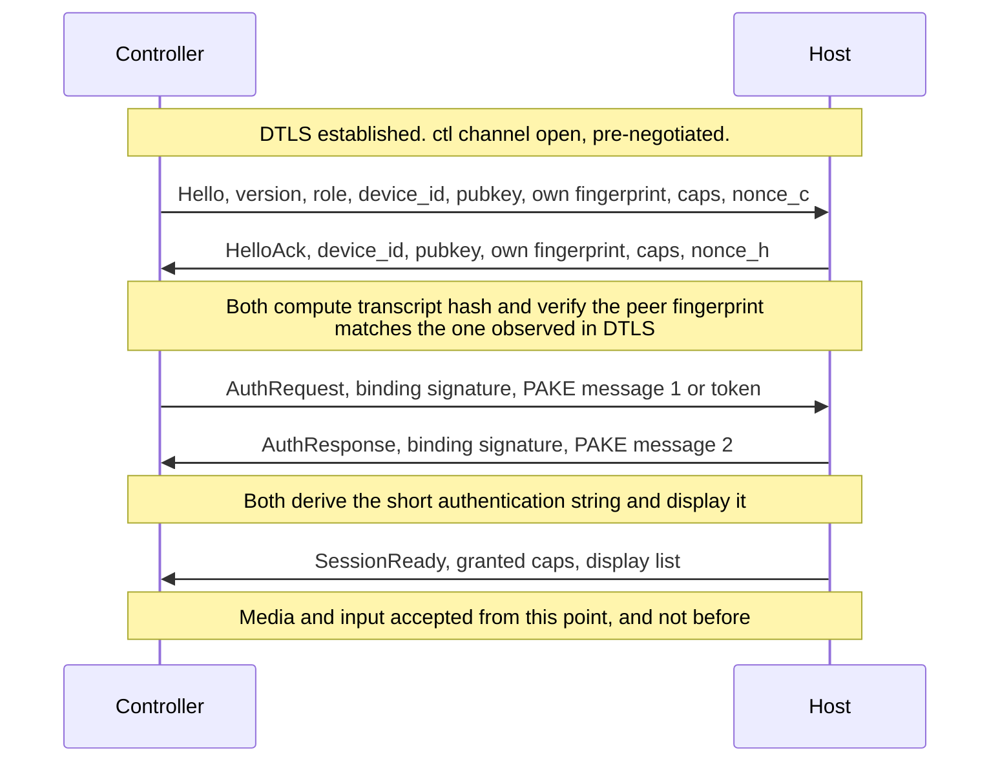

# RDA Wire Protocol Specification

**Version:** `0.1.0-draft`
**Status:** Phase 1 — normative draft. Implemented by Phase 2.
**Companion document:** [ARCHITECTURE.md](ARCHITECTURE.md)

The key words MUST, MUST NOT, REQUIRED, SHALL, SHALL NOT, SHOULD, SHOULD NOT, RECOMMENDED, MAY and OPTIONAL in
this document are to be interpreted as described in RFC 2119.

Throughout, **Controller** is the peer that views and controls; **Host** is the peer that shares its screen and
accepts input. Both are *peers*; the roles are per-session, not per-device.

---

## Table of Contents

1. [Conventions](#1-conventions)
2. [Versioning and Capability Negotiation](#2-versioning-and-capability-negotiation)
3. [Signaling Protocol](#3-signaling-protocol)
4. [Authentication Handshake](#4-authentication-handshake)
5. [DataChannel Topology](#5-datachannel-topology)
6. [Binary Control Frame Format](#6-binary-control-frame-format)
7. [Message Payloads](#7-message-payloads)
8. [Serialization Rationale](#8-serialization-rationale)
9. [RTP / Media Plane](#9-rtp--media-plane)
10. [Appendix A — Message Catalogue](#appendix-a--message-catalogue)
11. [Appendix B — Error Codes](#appendix-b--error-codes)

---

## 1. Conventions

- All multi-byte integers on the binary control plane are **big-endian (network byte order)**.
- Field offsets are **byte offsets from the start of the payload**, unless stated as header offsets.
- `u8`, `u16`, `u32`, `i16` denote unsigned/signed integers of that width. `Qm.n` denotes fixed-point with
  `n` fractional bits.
- Reserved fields MUST be written as zero and MUST be ignored on receipt.
- Binary examples are given as space-separated hexadecimal bytes.
- Sequence numbers use **RFC 1982 serial number arithmetic** for comparison; naive `<` comparison is
  non-conforming.

---

## 2. Versioning and Capability Negotiation

### 2.1 Version Numbering

The protocol version is a single `u8` **major** version carried in every control frame header (§6). Major
versions are incompatible. Minor evolution happens entirely through capabilities.

`0.1.0-draft` corresponds to wire major version `1`.

### 2.2 Forward Compatibility Rules

An implementation:

- MUST ignore control frames whose `Type` it does not recognise, **without** terminating the session.
- MUST ignore unknown JSON object members in signaling messages.
- MUST ignore trailing bytes in a control frame payload beyond the fields it knows, provided the frame's
  declared length is respected — this is how fields are added within a major version.
- MUST NOT infer a default for an unknown enum value. Unknown enum values MUST cause the individual message to
  be discarded, not the session.
- MUST reject a control frame whose payload is **shorter** than the minimum length defined for its `Type`, and
  MUST count this toward the malformed-frame limit (§6.5).

### 2.3 Capability Strings

Capabilities are exchanged as a list of strings in `register` (§3.3) and in `Hello` (§4.2). Format:
`v<major>.<domain>.<feature>`.

| Capability | Meaning |
|---|---|
| `v1.video.h264` | Can send **or** receive H.264 (role determined by SDP direction) |
| `v1.video.av1` | AV1 supported |
| `v1.video.hevc` | HEVC supported |
| `v1.video.ltr` | Supports LTR-based recovery (§9.4). Both peers REQUIRED for `RequestKeyframe` mode `LTR` |
| `v1.video.svc.t3` | Supports 3 temporal layers |
| `v1.audio.opus` | Opus supported |
| `v1.input.hid` | HID usage-based key injection (§7.5) |
| `v1.input.text` | Unicode text injection (§7.7) |
| `v1.input.relative` | Relative pointer mode (§7.2) |
| `v1.clip.text`, `v1.clip.image`, `v1.clip.files` | Clipboard type support |
| `v1.file.transfer` | File transfer |
| `v1.multimon` | Multiple display selection |

A feature MAY be used only if it appears in **both** peers' capability lists. `v1.input.hid` and
`v1.video.h264` are REQUIRED of all conforming implementations; everything else is OPTIONAL.

---

## 3. Signaling Protocol

### 3.1 Transport

Signaling MUST use WebSocket over TLS (`wss://`), TLS 1.3 RECOMMENDED. The server MUST reject non-TLS
connections. Clients MUST validate the server certificate and SHOULD pin the expected public key for
self-hosted deployments.

Messages are UTF-8 JSON text frames. A single WebSocket message carries exactly one protocol message. The
server MUST enforce a maximum message size of **64 KiB** and MUST close the connection on violation.

### 3.2 Envelope

Every message uses this envelope:

```json
{
  "v": 1,
  "id": "01J8XKQ7ZP3M4N5R6S7T8V9W0X",
  "t": "offer",
  "ts": 1755244800123,
  "sid": "sess_01J8XKQ8A1B2C3D4E5F6G7H8J9",
  "p": { }
}
```

| Field | Type | Required | Semantics |
|---|---|---|---|
| `v` | integer | yes | Protocol major version. MUST be `1` |
| `id` | string (ULID, 26 chars) | yes | Message identifier, unique per connection. Used to correlate `error` responses |
| `t` | string | yes | Message type (§3.3) |
| `ts` | integer | yes | Sender's Unix time in milliseconds. Advisory only; MUST NOT be used for security decisions |
| `sid` | string | no | Session identifier. REQUIRED for all session-scoped messages; absent for `challenge`, `register`, `register_ack`, `heartbeat` |
| `p` | object | yes | Type-specific payload. MAY be `{}` |

Unknown members at any level MUST be ignored (§2.2).

### 3.3 Message Types

#### `challenge` — Server → Client

Sent immediately on connection, before any client message is accepted.

```json
{ "v":1, "id":"…", "t":"challenge", "ts":…, "p": {
  "nonce": "c3RhdGljLW5vbmNlLTE2Qg",
  "server_time": 1755244800000,
  "min_client_version": "0.1.0"
}}
```

| Field | Type | Req | Semantics |
|---|---|---|---|
| `nonce` | base64url, 16 bytes | yes | Server-generated. MUST be from a CSPRNG, MUST be single-use, MUST expire in ≤ 60 s |
| `server_time` | integer | yes | Unix ms. Client MAY use it to detect gross clock skew |
| `min_client_version` | string | no | Clients below this SHOULD warn the user |

#### `register` — Client → Server

```json
{ "v":1, "id":"…", "t":"register", "ts":…, "p": {
  "device_id": "K7M2-9QXR-4TVB",
  "pubkey": "MCowBQYDK2VwAyEA…",
  "sig": "…64 bytes base64url…",
  "role": "host",
  "caps": ["v1.video.h264","v1.video.av1","v1.audio.opus","v1.input.hid","v1.input.text","v1.multimon"],
  "agent": "rda-host/0.1.0 (windows;x86_64)",
  "pop_rtt": { "iad": 12, "mrs": 96, "lhr": 88, "nbo": 210 }
}
```

| Field | Type | Req | Semantics / Constraints |
|---|---|---|---|
| `device_id` | string | yes | 12 chars, Crockford base32, grouped `XXXX-XXXX-XXXX`. Derived per §4.1 |
| `pubkey` | base64url, 32 bytes | yes | Ed25519 public key |
| `sig` | base64url, 64 bytes | yes | Ed25519 signature, see below |
| `role` | `"host"` \| `"controller"` \| `"both"` | yes | Determines whether the device is discoverable as a connect target |
| `caps` | string[] | yes | §2.3. Max 64 entries, each ≤ 48 chars |
| `agent` | string | no | Free-form, ≤ 128 chars. Diagnostics only |
| `pop_rtt` | object | no | PoP code → median RTT in ms, from the client's probes. Feeds the relay oracle |

The signature is computed over the byte string:

```
"RDA-v1-register" ‖ 0x00 ‖ nonce (16 bytes) ‖ device_id (UTF-8) ‖ role (UTF-8)
```

The server MUST verify `sig` against `pubkey`, MUST verify `device_id` matches the derivation in §4.1 for that
`pubkey`, and MUST reject a `nonce` it did not issue or has already consumed.

#### `register_ack` — Server → Client

```json
{ "v":1, "id":"…", "t":"register_ack", "ts":…, "p": {
  "device_id": "K7M2-9QXR-4TVB",
  "heartbeat_interval_s": 30,
  "session_ttl_s": 86400
}}
```

#### `heartbeat` / `heartbeat_ack`

Empty payload. The client MUST send `heartbeat` at `heartbeat_interval_s`. The server MUST treat a device as
offline after **2.5 ×** the interval without one. On a 220 ms path a 30 s interval is ample; shorter intervals
buy nothing and cost battery on mobile controllers.

#### `connect_request` — Controller → Server → Host

```json
{ "v":1, "id":"…", "t":"connect_request", "ts":…, "p": {
  "target": "K7M2-9QXR-4TVB",
  "from_pubkey": "…",
  "from_label": "Newton's MacBook",
  "auth_mode": "pin",
  "token": null,
  "requested_caps": ["input","clipboard","audio"]
}}
```

| Field | Type | Req | Semantics |
|---|---|---|---|
| `target` | string | yes | Host `device_id` |
| `from_pubkey` | base64url | yes | Controller identity key, so the Host can check its address book **before** prompting |
| `from_label` | string | no | Human-readable, ≤ 64 chars. MUST be displayed as untrusted, attacker-controlled text |
| `auth_mode` | `"pin"` \| `"token"` | yes | `pin` = attended, `token` = unattended |
| `token` | string \| null | cond | REQUIRED when `auth_mode` is `token` (§4.5) |
| `requested_caps` | string[] | yes | Subset of `view`, `input`, `clipboard`, `file`, `audio`. The Host grants a subset |

The server MUST forward this without inspecting or modifying it beyond routing, and MUST rate-limit
`connect_request` per source device.

#### `connect_response` — Host → Server → Controller

```json
{ "v":1, "id":"…", "t":"connect_response", "sid":"sess_…", "ts":…, "p": {
  "status": "accepted",
  "session_id": "sess_01J8XKQ8A1B2C3D4E5F6G7H8J9",
  "granted_caps": ["view","input","clipboard"],
  "reason": null
}}
```

`status` ∈ `accepted` | `rejected` | `busy` | `offline` | `unauthorized` | `timeout`.
`granted_caps` MUST be a subset of `requested_caps`. `reason` is a short machine code when not `accepted`.

The Host MUST NOT reveal, through timing or status, whether a `device_id` exists when the request is
unauthorized — `offline` and `unauthorized` SHOULD be indistinguishable to an unknown caller.

#### `offer` / `answer`

```json
{ "v":1, "id":"…", "t":"offer", "sid":"sess_…", "ts":…, "p": {
  "sdp": "v=0\r\no=- 4611731400430051336 2 IN IP4 127.0.0.1\r\n…",
  "sealed": null
}}
```

| Field | Type | Req | Semantics |
|---|---|---|---|
| `sdp` | string | cond | Plaintext SDP. REQUIRED unless `sealed` is present |
| `sealed` | object \| null | cond | E2E-encrypted SDP (§3.5) |

#### `ice_candidate`

```json
{ "v":1, "id":"…", "t":"ice_candidate", "sid":"sess_…", "ts":…, "p": {
  "candidate": "candidate:842163049 1 udp 1677729535 41.90.64.12 54321 typ srflx raddr 192.168.1.7 rport 54321 generation 0 ufrag Xy7Q network-cost 10",
  "sdpMid": "0",
  "sdpMLineIndex": 0,
  "usernameFragment": "Xy7Q"
}}
```

Trickle ICE (RFC 8838) MUST be supported; waiting for full gathering costs an unnecessary round trip on a
220 ms path. An end-of-candidates indication is signalled by `candidate` being an empty string.

#### `ice_restart`

Empty payload; triggers a new offer/answer with fresh ICE credentials. The authenticated session (§4) MUST be
preserved across an ICE restart: peers MUST re-verify the new DTLS fingerprint binding (§4.3) but MUST NOT
re-run the PAKE.

#### `relay_credentials` — Server → Both

```json
{ "v":1, "id":"…", "t":"relay_credentials", "sid":"sess_…", "ts":…, "p": {
  "ice_servers": [
    { "urls": ["stun:stun.mrs.example.net:3478"] },
    { "urls": ["turn:turn.mrs.example.net:3478?transport=udp",
               "turns:turn.mrs.example.net:5349?transport=tcp"],
      "username": "1755248400:sess_01J8XKQ8A1B2C3D4E5F6G7H8J9",
      "credential": "n1s7Qq2mB4kZ8xJ0pR5tYw3vLc=",
      "credentialType": "password" }
  ],
  "ttl_s": 3600,
  "preferred_order": ["mrs", "lhr", "nbo", "iad"]
}}
```

TURN credentials MUST use the time-limited REST mechanism: `username = "<unix_expiry>:<session_id>"`,
`credential = base64(HMAC-SHA1(shared_secret, username))`, matching coturn's `use-auth-secret` mode. The shared
secret MUST NOT leave the server. `ttl_s` MUST be ≤ 3600.

Clients MUST gather relay candidates from **at most the top two** entries in `preferred_order`. Each additional
relay candidate multiplies the ICE connectivity-check matrix, and every check round costs an RTT.

#### `peer_gone`

```json
{ "…": "…", "t":"peer_gone", "sid":"sess_…", "p": { "reason": "disconnected" }}
```

`reason` ∈ `disconnected` | `replaced` | `evicted` | `shutdown`.

#### `error`

```json
{ "v":1, "id":"…", "t":"error", "ts":…, "p": {
  "code": 4103,
  "message": "unknown target device",
  "in_reply_to": "01J8XKQ7ZP3M4N5R6S7T8V9W0X",
  "retry_after_s": null
}}
```

See [Appendix B](#appendix-b--error-codes).

### 3.4 Annotated SDP

The lines that matter to this system:

```sdp
v=0
o=- 4611731400430051336 2 IN IP4 127.0.0.1
s=-
t=0 0
a=group:BUNDLE 0 1 2                  ; BUNDLE (RFC 9143): one transport, one ICE/DTLS handshake.
                                      ; REQUIRED — separate transports would cost extra RTTs and extra
                                      ; NAT bindings.
a=msid-semantic: WMS rda
m=video 9 UDP/TLS/RTP/SAVPF 96 97 98 99 100
c=IN IP4 0.0.0.0
a=rtcp-mux                            ; REQUIRED. Separate RTCP port doubles the hole-punching work.
a=rtcp-rsize                          ; Reduced-size RTCP: less overhead on frequent feedback.
a=ice-ufrag:Xy7Q
a=ice-pwd:8f3Qm2kZpR5tYw3vLc9nB4x
a=ice-options:trickle
a=fingerprint:sha-256 A1:B2:…:FF      ; <-- BOUND TO THE IDENTITY KEY BY SIGNATURE (§4.3).
                                      ;     A signaling server that substitutes this line is detected.
a=setup:actpass
a=mid:0
a=sendonly                            ; Host sends video; the Controller does not.
a=rtpmap:96 H264/90000
a=fmtp:96 level-asymmetry-allowed=1;packetization-mode=1;profile-level-id=640c1f
a=rtpmap:97 rtx/90000
a=fmtp:97 apt=96
a=rtpmap:98 AV1/90000
a=fmtp:98 level-idx=5;profile=0;tier=0
a=rtpmap:99 rtx/90000
a=fmtp:99 apt=98
a=rtpmap:100 flexfec-03/90000         ; FEC (§9.3). The primary loss-recovery mechanism on this corridor.
a=fmtp:100 repair-window=200000
a=rtcp-fb:96 nack                     ; Retained, but the SENDER applies the deadline rule in
                                      ; ARCHITECTURE.md §2.2 — NACK is used only for reference frames.
a=rtcp-fb:96 nack pli
a=rtcp-fb:96 ccm fir
a=rtcp-fb:96 transport-cc             ; Send-side BWE. REQUIRED.
a=extmap:1 http://www.webrtc.org/experiments/rtp-hdrext/abs-send-time
a=extmap:2 http://www.ietf.org/id/draft-holmer-rmcat-transport-wide-cc-extensions-01
a=extmap:3 https://aomediacodec.github.io/av1-rtp-spec/#dependency-descriptor-rtp-header-extension
a=extmap:4 http://www.webrtc.org/experiments/rtp-hdrext/playout-delay
a=extmap:5 urn:ietf:params:rtp-hdrext:sdes:mid
a=extmap:6 http://www.webrtc.org/experiments/rtp-hdrext/video-timing
m=audio 9 UDP/TLS/RTP/SAVPF 111
a=mid:1
a=sendonly
a=rtpmap:111 opus/48000/2
a=fmtp:111 minptime=10;useinbandfec=1;usedtx=1
a=rtcp-fb:111 transport-cc
m=application 9 UDP/DTLS/SCTP webrtc-datachannel
a=mid:2
a=sctp-port:5000
a=max-message-size:262144             ; 256 KiB. Caps the SCTP reassembly buffer an attacker can force.
```

### 3.5 SDP Confidentiality

By default the signaling server **can read the SDP**, and therefore learns candidate IP addresses, codecs and
the DTLS fingerprints. It cannot MITM the media — §4.3 prevents that — but it does learn metadata.

Implementations SHOULD support **sealed SDP** where both peers already know each other's identity keys
(address-book peers). The `sealed` object replaces `sdp`:

```json
"sealed": { "alg": "x25519-chacha20poly1305", "epk": "…32 bytes…", "ct": "…", "nonce": "…12 bytes…" }
```

The payload is sealed to the recipient's X25519 key derived from its Ed25519 identity key. The server then
routes ciphertext it cannot read. This MUST NOT be used for first contact, where the peers have no prior key.

---

## 4. Authentication Handshake

Runs on the `ctl` DataChannel **after** DTLS completes and **before** any media or input is accepted.

### 4.1 Device Identity

Each device generates an Ed25519 keypair on first run and stores the private key in the OS keystore (Windows
DPAPI/CNG, macOS Keychain, Linux Secret Service, with a file fallback at mode `0600`).

```
device_id = crockford_base32( SHA-256("RDA-v1-devid" ‖ 0x00 ‖ pubkey)[0..8] )[0..12]
```

Rendered to users grouped in threes: `K7M2-9QXR-4TVB`. 60 bits of entropy — sufficient to make guessing a
specific device impractical while remaining human-transcribable over a phone call.

### 4.2 Handshake Sequence



### 4.3 Fingerprint Binding — the Anti-MITM Mechanism

This is the mechanism that makes an untrusted signaling server and an untrusted TURN relay acceptable.

Each peer signs, with its long-term Ed25519 identity key:

```
binding = "RDA-v1-binding"           (14 bytes, ASCII)
        ‖ 0x00
        ‖ session_id                 (26 bytes, ASCII ULID)
        ‖ nonce_controller           (32 bytes)
        ‖ nonce_host                 (32 bytes)
        ‖ fp_controller              (32 bytes, raw SHA-256 of the Controller's DTLS cert)
        ‖ fp_host                    (32 bytes, raw SHA-256 of the Host's DTLS cert)
        ‖ role                       (1 byte: 0x01 controller, 0x02 host)
```

Fingerprints appear in fixed role order, not sorted, so both peers construct an identical structure without
ambiguity.

A verifier MUST:

1. Compute the SHA-256 fingerprint of the DTLS certificate **actually presented in the completed handshake** —
   never the value copied from the SDP.
2. Confirm that value equals the `fp_*` field for that role in the signed structure.
3. Verify the Ed25519 signature against the peer's identity public key.
4. Confirm the identity public key matches the address-book entry for that `device_id`; on first contact,
   pin it (TOFU) and require the short authentication string check (§4.6).
5. Abort the session on any failure. Implementations MUST NOT offer a "continue anyway" option.

Step 1 is the whole point: a malicious signaling server that rewrites the SDP fingerprint terminates DTLS
itself, so the certificate it presents cannot match the one the legitimate peer signed.

### 4.4 PIN Authentication (Attended)

Uses **SPAKE2** (balanced PAKE), Rust crate `spake2`, over the session PIN.

- The Host generates a **6-digit** PIN from a CSPRNG, displays it locally, and the user conveys it
  out-of-band. It MUST be single-use and MUST expire after 5 minutes.
- The SPAKE2 password input MUST be `SHA-256("RDA-v1-pin" ‖ 0x00 ‖ session_id ‖ pin)`, binding the PAKE to the
  session and preventing cross-session replay.
- Identity strings: `"RDA-v1-controller"` and `"RDA-v1-host"`.
- Failed attempts MUST be rate-limited: **3 attempts per PIN**, then the PIN is invalidated and a new one is
  generated. Exponential backoff per source identity across PINs.
- A 6-digit PIN is only 20 bits; the attempt cap, not the entropy, is what makes it safe. This is why the
  cap is normative.

### 4.5 Token Authentication (Unattended)

Unattended access deliberately uses **no password**. The Host issues a token bound to a specific controller
identity:

```
token = base64url( CBOR{
    v:    1,
    sub:  <controller Ed25519 pubkey, 32 bytes>,
    iss:  <host device_id, 12 chars>,
    iat:  <unix seconds>,
    exp:  <unix seconds, iat + 30 days max>,
    jti:  <16 random bytes>,
    caps: ["view","input","clipboard"]
} ‖ Ed25519_sign(host_identity_key, cbor_bytes) )
```

- Issuing a token REQUIRES local physical interaction at the Host. It MUST NOT be issuable by a remote party
  during an active session.
- The Host MUST maintain a revocation list keyed by `jti` and MUST check it on every use.
- Tokens MUST rotate on use: a successful authentication issues a replacement and invalidates the old `jti`.
  A replayed old token after rotation indicates theft and SHOULD raise a user-visible alert.
- Possession of a token alone MUST NOT authenticate — the controller MUST also prove possession of the private
  key matching `sub` via the §4.3 binding signature.

### 4.6 Short Authentication String

Both peers derive:

```
sas = HKDF-SHA256(ikm = transcript_hash, salt = session_id, info = "RDA-v1-sas", len = 8 bytes)
```

rendered as **four words** from a fixed 2048-word list (BIP-39 English is a reasonable choice — 44 bits across
four words). Displayed at both ends and compared by the humans over the voice channel they are already using.
This defeats a MITM even on first contact, where no identity is pinned. Implementations SHOULD display it
prominently on first contact and MAY hide it for address-book peers with pinned keys.

---

## 5. DataChannel Topology

All channels MUST be **pre-negotiated** (`negotiated: true`) with the stream IDs below. DCEP in-band
negotiation costs one round trip per channel — ~220 ms each on this corridor — and is therefore prohibited.
Applications MUST create all channels on both peers before signaling completes.

| Label | ID | Ordered | maxRetransmits | maxPacketLifeTime | Priority | Purpose / failure mode avoided |
|---|---:|---|---|---|---|---|
| `ctl` | 0 | yes | *(reliable)* | — | high | Handshake, session control, display config, keyframe requests. Correctness beats latency |
| `input-k` | 1 | yes | *(reliable)* | — | high | Keys, buttons, wheel, text, `KeyStateSync`. A lost key-up is a stuck key; reorder inverts a keystroke |
| `input-p` | 2 | **no** | **0** | — | high | Pointer motion. A reliable channel would stall ≥1 s on loss (SCTP min RTO); a stale position has negative value |
| `cursor` | 3 | no | — | 250 ms | normal | Host→Controller cursor position and shape |
| `stats` | 4 | no | 0 | — | low | Telemetry. Never worth a retransmission |
| `clip` | 5 | yes | *(reliable)* | — | normal | Clipboard. Isolated so a large paste cannot block `ctl` |
| `file` | 6 | yes | *(reliable)* | — | low | File transfer. Isolated so a multi-GB transfer cannot head-of-line-block anything |
| `video` | 7 | **no** | — | 500 ms | high | Compressed video where RTP is unavailable (§7.13). Unordered because fragments are indexed and reassembled by the application |

**Head-of-line blocking is per SCTP stream.** This is the entire reason for the split: a stalled reliable
stream does not delay an unreliable one. Multiplexing all input onto one channel would couple the fate of
cursor motion to the fate of keystroke delivery, which is exactly the coupling this table exists to break.

`max-message-size` is 256 KiB (§3.4), and no stack we interoperate with negotiates above 64 KiB. Messages
larger than the negotiated ceiling MUST be fragmented by the application; receivers MUST cap reassembly and
abort the channel on violation. Video uses the explicit fragment header of §7.13 rather than the `MORE` flag,
because an unordered channel gives no meaning to "the next message".

---

## 6. Binary Control Frame Format

### 6.1 Header

Every message on `ctl`, `input-k`, `input-p`, `cursor` and `stats` begins with this **8-byte** header.
One frame per SCTP message; SCTP preserves message boundaries, so no length prefix is carried.

```
 0                   1                   2                   3
 0 1 2 3 4 5 6 7 8 9 0 1 2 3 4 5 6 7 8 9 0 1 2 3 4 5 6 7 8 9 0 1
+-+-+-+-+-+-+-+-+-+-+-+-+-+-+-+-+-+-+-+-+-+-+-+-+-+-+-+-+-+-+-+-+
|  Ver  | Flags |     Type      |           Sequence            |
+-+-+-+-+-+-+-+-+-+-+-+-+-+-+-+-+-+-+-+-+-+-+-+-+-+-+-+-+-+-+-+-+
|                          Timestamp                            |
+-+-+-+-+-+-+-+-+-+-+-+-+-+-+-+-+-+-+-+-+-+-+-+-+-+-+-+-+-+-+-+-+
|                    Payload (Type-specific)                    |
+-+-+-+-+-+-+-+-+-+-+-+-+-+-+-+-+-+-+-+-+-+-+-+-+-+-+-+-+-+-+-+-+
```

| Field | Bits | Offset | Type | Semantics |
|---|---:|---:|---|---|
| `Ver` | 4 | 0 (high nibble of byte 0) | u4 | Protocol major version. MUST be `1`. Frames with another value MUST be dropped |
| `Flags` | 4 | 0 (low nibble of byte 0) | u4 | §6.2 |
| `Type` | 8 | 1 | u8 | Message type (§6.3) |
| `Sequence` | 16 | 2–3 | u16 BE | Per-channel, per-direction, incrementing, wrapping. RFC 1982 comparison |
| `Timestamp` | 32 | 4–7 | u32 BE | **Milliseconds since session epoch** (the moment `SessionReady` is sent). Wraps after ~49.7 days, which no session reaches |

Milliseconds, not microseconds, is deliberate: a `u32` of microseconds wraps every 71.6 minutes, which sessions
routinely exceed, and sub-millisecond precision has no consumer on the input path. Fine-grained media timing
lives in RTP, not here.

### 6.2 Flags

| Bit | Mask | Name | Meaning |
|---:|---|---|---|
| 0 | `0x1` | `MORE` | This frame is a non-final fragment of a larger message. Reassemble by `Type` and consecutive `Sequence` |
| 1 | `0x2` | `SYNTHETIC` | Generated by reconciliation (§7.6), not by a real user action. For audit logs |
| 2 | `0x4` | — | Reserved. MUST be 0 |
| 3 | `0x8` | — | Reserved. MUST be 0 |

### 6.3 Type Registry

| Range | Domain |
|---|---|
| `0x01`–`0x0F` | Session control |
| `0x10`–`0x2F` | Input |
| `0x30`–`0x3F` | Display, quality, cursor |
| `0x40`–`0x4F` | Clipboard and files |
| `0x50`–`0x5F` | Telemetry |

| Code | Name | Channel | Direction | Min payload |
|---|---|---|---|---:|
| `0x01` | `Hello` | `ctl` | both | variable |
| `0x02` | `HelloAck` | `ctl` | H→C | variable |
| `0x03` | `AuthRequest` | `ctl` | both | variable |
| `0x04` | `AuthResponse` | `ctl` | both | variable |
| `0x05` | `SessionReady` | `ctl` | H→C | variable |
| `0x06` | `Ping` | `ctl` | both | 4 |
| `0x07` | `Pong` | `ctl` | both | 8 |
| `0x08` | `Pause` | `ctl` | C→H | 1 |
| `0x09` | `Resume` | `ctl` | C→H | 1 |
| `0x0A` | `EndSession` | `ctl` | both | 2 |
| `0x0B` | `Error` | `ctl` | both | 4 |
| `0x10` | `MouseMove` | `input-p` | C→H | 8 |
| `0x11` | `MouseMoveRelative` | `input-p` | C→H | 8 |
| `0x12` | `MouseButton` | `input-k` | C→H | 10 |
| `0x13` | `MouseWheel` | `input-k` | C→H | 8 |
| `0x14` | `KeyEvent` | `input-k` | C→H | 8 |
| `0x15` | `KeyStateSync` | `input-k` | C→H | 4 |
| `0x16` | `TextInput` | `input-k` | C→H | 4 |
| `0x30` | `DisplayList` | `ctl` | H→C | variable |
| `0x31` | `DisplaySelect` | `ctl` | C→H | 2 |
| `0x32` | `QualityHint` | `ctl` | C→H | 8 |
| `0x33` | `RequestKeyframe` | `ctl` | C→H | 4 |
| `0x34` | `LtrAck` | `ctl` | C→H | 4 |
| `0x35` | `CursorUpdate` | `cursor` | H→C | 10 |
| `0x36` | `CursorShape` | `cursor` | H→C | 18 |
| `0x37` | `VideoFrame` | `video` | H→C | 20 |
| `0x40` | `ClipboardOffer` | `clip` | both | 8 |
| `0x41` | `ClipboardRequest` | `clip` | both | 4 |
| `0x42` | `ClipboardData` | `clip` | both | 8 |
| `0x50` | `QosReport` | `stats` | both | 16 |

### 6.4 Sequence and Timestamp Rules

- `Sequence` is maintained **per channel, per direction**, and increments by 1 per frame including fragments.
- A receiver MUST discard a `MouseMove` or `MouseMoveRelative` whose `Sequence` is *older* than the last
  applied one (RFC 1982). Stale positions are worse than no position.
- A receiver MUST NOT apply stale-rejection to reliable-channel messages; SCTP already guarantees their order.
- `Timestamp` is advisory. It MUST NOT be used for authorization or replay protection — the DTLS/SCTP layer
  provides those.

### 6.5 Malformed Frame Handling

A receiver MUST discard, and MUST NOT terminate the session on:
unknown `Type`; unknown enum value; payload shorter than the type minimum; a field failing its validation rule.

A receiver MUST maintain a malformed-frame counter per session and MUST terminate the session when it exceeds
**100 within 10 seconds**. This bounds an attacker's ability to probe the parser while tolerating the genuine
version skew that §2.2 permits.

---

## 7. Message Payloads

All offsets below are relative to the **start of the payload**, i.e. byte 8 of the frame.

### 7.1 `MouseMove` (`0x10`) — 8 bytes

| Offset | Size | Type | Field | Semantics / Validation |
|---:|---:|---|---|---|
| 0 | 1 | u8 | `display_id` | MUST match a live entry in `DisplayList`; otherwise discard |
| 1 | 1 | u8 | `flags` | bit0 `COALESCED`. Others reserved, MUST be 0 |
| 2 | 2 | u16 | `x_norm` | `0..=65535` across the display's width. No invalid values |
| 4 | 2 | u16 | `y_norm` | `0..=65535` across the display's height |
| 6 | 2 | u16 | `modifiers` | §7.9 bitmask. Triggers reconciliation on mismatch |

Host mapping: `pixel_x = display.x + round(x_norm × (display.width − 1) / 65535)`, and likewise for `y`. The
result MUST be clamped to the display rect.

### 7.2 `MouseMoveRelative` (`0x11`) — 8 bytes

| Offset | Size | Type | Field | Semantics / Validation |
|---:|---:|---|---|---|
| 0 | 2 | i16 | `dx` | Q13.3 — units of ⅛ device pixel. Range ±4096 px |
| 2 | 2 | i16 | `dy` | Q13.3 |
| 4 | 2 | u16 | `modifiers` | §7.9 |
| 6 | 1 | u8 | `display_id` | Display the pointer is captured on |
| 7 | 1 | u8 | reserved | MUST be 0 |

Used only when the Host has signalled pointer capture. The Controller MUST NOT choose relative mode unilaterally.

### 7.3 `MouseButton` (`0x12`) — 10 bytes

| Offset | Size | Type | Field | Semantics / Validation |
|---:|---:|---|---|---|
| 0 | 1 | u8 | `button` | `1` left, `2` right, `3` middle, `4` X1, `5` X2. Other values discarded |
| 1 | 1 | u8 | `action` | `0` up, `1` down. Other values discarded |
| 2 | 2 | u16 | `x_norm` | As §7.1 |
| 4 | 2 | u16 | `y_norm` | As §7.1 |
| 6 | 2 | u16 | `modifiers` | §7.9 |
| 8 | 1 | u8 | `display_id` | As §7.1 |
| 9 | 1 | u8 | `click_count` | `1`–`3`, advisory. Host MAY synthesise double-click timing itself |

Button events **carry their own coordinates** because pointer motion travels on an unreliable channel. Without
this, a dropped `MouseMove` immediately before a click would place the click at the wrong location — a silent
and serious correctness bug. The Host MUST move the pointer to `(x_norm, y_norm)` before applying the button
transition.

### 7.4 `MouseWheel` (`0x13`) — 8 bytes

| Offset | Size | Type | Field | Semantics / Validation |
|---:|---:|---|---|---|
| 0 | 2 | i16 | `delta_v` | Units of 1/120 notch. `120` = one traditional detent up. Matches Windows `WHEEL_DELTA` and supports high-resolution trackpads |
| 2 | 2 | i16 | `delta_h` | Horizontal, same units |
| 4 | 2 | u16 | `modifiers` | §7.9 |
| 6 | 1 | u8 | `display_id` | |
| 7 | 1 | u8 | `flags` | bit0 `PRECISE` (continuous device), bit1 `INVERTED_APPLIED` (natural scrolling already applied by the Controller) |

Natural-scroll inversion MUST be resolved on the Controller and marked with `INVERTED_APPLIED`. Applying it on
both ends is a common double-inversion bug.

### 7.5 `KeyEvent` (`0x14`) — 8 bytes

| Offset | Size | Type | Field | Semantics / Validation |
|---:|---:|---|---|---|
| 0 | 2 | u16 | `usage_page` | `0x0007` keyboard/keypad, `0x000C` consumer. Others discarded |
| 2 | 2 | u16 | `usage_id` | HID usage. For page `0x0007`, MUST be in `0x01..=0xE7` and in the allowlist |
| 4 | 1 | u8 | `action` | `0` up, `1` down, `2` repeat |
| 5 | 1 | u8 | `flags` | bit0 `SYNTHETIC` (from reconciliation) |
| 6 | 2 | u16 | `modifiers` | §7.9 |

The Host MUST translate `usage_id` to the native identifier as described in ARCHITECTURE.md §4.2 and MUST NOT
accept a raw platform keycode from the wire.

### 7.6 `KeyStateSync` (`0x15`) — 4 + 2N bytes

| Offset | Size | Type | Field | Semantics / Validation |
|---:|---:|---|---|---|
| 0 | 2 | u16 | `modifiers` | Authoritative modifier state |
| 2 | 1 | u8 | `count` | N, `0..=32`. Values > 32 MUST cause the frame to be discarded |
| 3 | 1 | u8 | `flags` | bit0 `AUTHORITATIVE` — the Host MUST fully reconcile, not merely merge |
| 4 | 2N | u16[] | `pressed` | HID usage IDs, page `0x0007` implied. SHOULD be ascending |

Sent every **250 ms** while any key is held, and **once** on the transition to all-keys-up. Reconciliation:

```
if seq is stale (RFC 1982):  discard
for usage in host_pressed \ sync.pressed:   inject KeyUp(usage)   with SYNTHETIC
for usage in sync.pressed \ host_pressed:   inject KeyDown(usage) with SYNTHETIC
reconcile modifiers to sync.modifiers
host_pressed := sync.pressed
```

The all-up sync is what bounds the lifetime of a lost `KeyUp` to 250 ms. Implementations MUST send it.

### 7.7 `TextInput` (`0x16`) — 4 + L bytes

| Offset | Size | Type | Field | Semantics / Validation |
|---:|---:|---|---|---|
| 0 | 2 | u16 | `byte_len` | L, `1..=1024`. Larger MUST be discarded |
| 2 | 1 | u8 | `flags` | bit0 `COMMIT`, bit1 `PREEDIT` (IME composition in progress) |
| 3 | 1 | u8 | reserved | MUST be 0 |
| 4 | L | u8[] | `text` | UTF-8. MUST be valid UTF-8; MUST reject C0 control characters other than `0x09` and `0x0A` |

### 7.8 `CursorUpdate` (`0x35`) / `CursorShape` (`0x36`)

`CursorUpdate` — 10 bytes:

| Offset | Size | Type | Field |
|---:|---:|---|---|
| 0 | 4 | u32 | `shape_id` — `0` means hidden |
| 4 | 2 | u16 | `x_norm` |
| 6 | 2 | u16 | `y_norm` |
| 8 | 1 | u8 | `display_id` |
| 9 | 1 | u8 | `flags` — bit0 `VISIBLE` |

`CursorShape` — 18 + L bytes:

| Offset | Size | Type | Field | Validation |
|---:|---:|---|---|---|
| 0 | 4 | u32 | `shape_id` | |
| 4 | 2 | u16 | `width` | `1..=256` |
| 6 | 2 | u16 | `height` | `1..=256` |
| 8 | 2 | u16 | `hotspot_x` | `< width` |
| 10 | 2 | u16 | `hotspot_y` | `< height` |
| 12 | 1 | u8 | `format` | `0` BGRA8 premultiplied, `1` PNG |
| 13 | 1 | u8 | reserved | MUST be 0 |
| 14 | 4 | u32 | `data_len` | L. MUST be ≤ 256 KiB **and**, for format `0`, MUST equal `width × height × 4` |
| 18 | L | u8[] | `data` | |

The Host sends a shape once per session per distinct `shape_id` and thereafter references it by ID. The
Controller maintains an LRU cache of at least 64 shapes and MUST render the last known shape if an ID is
unknown, rather than blocking.

### 7.9 Modifier Bitmask (`u16`)

Bits 0–7 are **identical to the USB HID boot-protocol keyboard modifier byte**, which keeps translation trivial:

| Bit | Mask | Modifier |
|---:|---|---|
| 0 | `0x0001` | Left Ctrl |
| 1 | `0x0002` | Left Shift |
| 2 | `0x0004` | Left Alt |
| 3 | `0x0008` | Left GUI (Win / Cmd) |
| 4 | `0x0010` | Right Ctrl |
| 5 | `0x0020` | Right Shift |
| 6 | `0x0040` | Right Alt / AltGr |
| 7 | `0x0080` | Right GUI |
| 8 | `0x0100` | Caps Lock (state) |
| 9 | `0x0200` | Num Lock (state) |
| 10 | `0x0400` | Scroll Lock (state) |
| 11–15 | — | Reserved, MUST be 0 |

### 7.10 `RequestKeyframe` (`0x33`) — 4 bytes

| Offset | Size | Type | Field | Semantics |
|---:|---:|---|---|---|
| 0 | 1 | u8 | `mode` | `0` = IDR (last resort), `1` = LTR recovery |
| 1 | 1 | u8 | `ltr_index` | Valid when `mode == 1`. The last successfully decoded LTR the receiver holds |
| 2 | 2 | u16 | `reason` | `0` decode failure, `1` display change, `2` session start, `3` user request |

Receivers MUST prefer `mode = 1` whenever they hold a valid acknowledged LTR. Senders MUST rate-limit honoured
IDR requests to **one per second per session**, coalescing further requests within that window. See
ARCHITECTURE.md §2.2 and §2.4 for why this rule exists.

### 7.11 `QosReport` (`0x50`) — 16 bytes

| Offset | Size | Type | Field | Units |
|---:|---:|---|---|---|
| 0 | 2 | u16 | `rtt_ms` | Application-level RTT from `Ping`/`Pong` |
| 2 | 2 | u16 | `jitter_ms` | Inter-arrival jitter, p95 over 10 s |
| 4 | 2 | u16 | `loss_permille` | `0..=1000` |
| 6 | 2 | u16 | `frames_decoded` | Since the last report |
| 8 | 2 | u16 | `frames_dropped` | Since the last report |
| 10 | 2 | u16 | `render_fps` | Q8.8 fixed point |
| 12 | 2 | u16 | `playout_delay_ms` | Current jitter buffer target |
| 14 | 2 | u16 | `decode_time_us` | Mean per frame |

Sent every 1 s on `stats`. Advisory: it supplements RTCP, it does not replace it.

### 7.12 Worked Examples

**`MouseMove`** — pointer to the horizontal centre, 25 % down, display 0, no modifiers, sequence 1234
(`0x04D2`), timestamp 123456 ms (`0x0001E240`):

```
10 10 04 D2 00 01 E2 40 | 00 00 80 00 40 00 00 00
```

| Bytes | Value | Field |
|---|---|---|
| `10` | Ver `1`, Flags `0x0` | Version 1, no flags |
| `10` | `0x10` | Type = `MouseMove` |
| `04 D2` | 1234 | Sequence |
| `00 01 E2 40` | 123456 | Timestamp, ms since session epoch |
| `00` | 0 | `display_id` |
| `00` | 0 | `flags` |
| `80 00` | 32768 | `x_norm` → 50.0 % of width |
| `40 00` | 16384 | `y_norm` → 25.0 % of height |
| `00 00` | 0 | `modifiers` |

Frame total: **16 bytes**.

**`KeyEvent`** — press `A` (HID usage `0x04`) while Left Shift is held, sequence 1235, timestamp 123460 ms:

```
10 14 04 D3 00 01 E2 44 | 00 07 00 04 01 00 00 02
```

| Bytes | Value | Field |
|---|---|---|
| `10` | Ver 1, Flags 0 | |
| `14` | `0x14` | Type = `KeyEvent` |
| `04 D3` | 1235 | Sequence |
| `00 01 E2 44` | 123460 | Timestamp |
| `00 07` | `0x0007` | `usage_page` = Keyboard/Keypad |
| `00 04` | `0x0004` | `usage_id` = keyboard `a`/`A` |
| `01` | 1 | `action` = down |
| `00` | 0 | `flags` |
| `00 02` | `0x0002` | `modifiers` = Left Shift |

Frame total: **16 bytes**. Note that the wire carries the *physical key* and the modifier state — never the
character `A`. Which character results is the Host's layout's business.

**`KeyStateSync`** — Left Shift (`0xE1`) and `A` (`0x04`) currently held, authoritative, sequence 1236,
timestamp 123560 ms (`0x0001E2A8`):

```
10 15 04 D4 00 01 E2 A8 | 00 02 02 01 00 E1 00 04
```

| Bytes | Value | Field |
|---|---|---|
| `10` | Ver 1, Flags 0 | |
| `15` | `0x15` | Type = `KeyStateSync` |
| `04 D4` | 1236 | Sequence |
| `00 01 E2 A8` | 123560 | Timestamp |
| `00 02` | `0x0002` | `modifiers` = Left Shift |
| `02` | 2 | `count` = 2 pressed keys |
| `01` | `0x01` | `flags` = `AUTHORITATIVE` |
| `00 E1` | `0x00E1` | `pressed[0]` = Left Shift |
| `00 04` | `0x0004` | `pressed[1]` = `a`/`A` |

Frame total: **16 bytes**. If the Host believed Left Ctrl were also down, this frame would cause it to inject
a synthetic Left Ctrl key-up — the stuck-modifier repair.

### 7.13 `VideoFrame` (`0x37`) — 20 + L bytes

Carries compressed video over a DataChannel rather than RTP. RTP is the normal path (§4) and remains
so; this exists for the cases where it is not available — a peer that negotiated no media section, a
diagnostic or headless receiver, or a build without an RTP stack. A conforming implementation MUST
implement RTP; `VideoFrame` is OPTIONAL, and its absence MUST NOT fail a session.

| Offset | Size | Type | Field | Semantics |
|---:|---:|---|---|---|
| 0 | 4 | u32 | `frame_id` | Identifies the frame these fragments belong to. Wraps; only equality is meaningful |
| 4 | 2 | u16 | `fragment_index` | Position of this fragment, from 0. MUST be `< fragment_count` |
| 6 | 2 | u16 | `fragment_count` | Fragments in the whole frame. MUST be ≥ 1 |
| 8 | 1 | u8 | `kind` | `0` delta, `1` keyframe (IDR), `2` LTR recovery. Values > 2 MUST be rejected |
| 9 | 1 | u8 | `temporal_layer` | Layer this frame belongs to, so a receiver knows what is discardable (§2.4) |
| 10 | 8 | u64 | `pts_us` | Presentation timestamp, µs since the session epoch. Identical across all fragments of a frame |
| 18 | 4 | u32 | `data_len` | Bytes of bitstream in **this fragment** |
| 22 | L | bytes | `data` | Annex B for H.264/HEVC, OBU sequence for AV1 |

**Why every fragment repeats the frame metadata.** On an unordered channel the first fragment to
arrive is not necessarily index 0. Repeating `kind`, `temporal_layer` and `pts_us` lets a receiver
classify a frame — and decide whether it is worth reassembling at all — from whichever fragment
reaches it first, rather than being blind until index 0 shows up. Twelve bytes per fragment is a
rounding error against a 16 KiB payload.

**Fragment size (normative).** A sender MUST NOT put more than **16 KiB** of bitstream in one
fragment. This is well below any negotiated `max-message-size`, and the choice is about loss
granularity rather than the ceiling: SCTP delivers a message whole or not at all, so on an unreliable
channel the message size *is* the loss quantum. At 64 KiB one lost chunk costs a quarter of a frame;
at 16 KiB it costs a sixteenth.

**Reassembly (normative).** Receivers MUST:

- reject `fragment_count == 0`, `fragment_index >= fragment_count`, and `data_len > 16 KiB`;
- cap a reassembled frame at **2 MiB** and abandon anything larger;
- cap frames in flight, abandoning the oldest first;
- abandon an incomplete frame after **400 ms**, and MUST NOT resurrect it if a missing fragment
  arrives afterwards;
- discard a fragment whose `pts_us` or `fragment_count` contradicts an earlier fragment of the same
  `frame_id`, rather than splicing two frames' bitstreams together;
- treat a duplicate fragment as a no-op.

Receivers MUST NOT pass a partially reassembled frame to a jitter buffer or decoder. A partial frame
is not a frame, and scheduling playout for one guarantees a missed deadline for something that could
never have been shown.

---

## 8. Serialization Rationale

**Hot path — hand-rolled fixed-layout binary** (§6, §7). Input messages are 16–24 bytes with a fixed layout,
parse with bounds-checked slice reads and no allocation, and are trivially fuzzable. A self-describing format
would double the size and add a parser with far more attack surface for no benefit on messages whose shape
never varies.

**Cold path — CBOR** (crate `ciborium`) for handshake and token structures, where extensibility matters, volume
is negligible, and the deterministic encoding profile keeps signatures reproducible. Signaling uses JSON
(crate `serde_json`) for debuggability — one can read a signaling trace in a terminal, which is worth more than
the bytes saved. `bincode` is deliberately **not** used on the wire: it is a Rust-specific format, and the
protocol must be implementable in other languages.

**Bandwidth arithmetic.** A `MouseMove` frame is 16 bytes, plus ~28 bytes of SCTP/DTLS/UDP/IP overhead ≈ 44
bytes on the wire.

| Send rate | Frames/s | Wire bandwidth |
|---|---:|---:|
| Uncoalesced 1000 Hz gaming mouse | 1000 | **~352 kbps** |
| Uncoalesced 125 Hz standard mouse | 125 | ~44 kbps |
| **Coalesced to 60 Hz (normative)** | 60 | **~21 kbps** |

352 kbps of pointer data on a congested 800 kbps Kenyan link would be actively harmful, and the packet *rate*
matters as much as the bitrate on a path with a constrained middlebox. Hence:

**Coalescing rule (normative).** Controllers MUST coalesce pointer motion to at most the negotiated video frame
rate, capped at 60 Hz, keeping the most recent position. Controllers MUST NOT coalesce across a button
transition: any pending motion MUST be flushed before a `MouseButton` frame, so the click's coordinates and the
motion history remain consistent.

---

## 9. RTP / Media Plane

### 9.1 Payload Types

| PT | Codec | Notes |
|---:|---|---|
| 96 | H.264 | `packetization-mode=1`, High profile `640c1f` preferred, Constrained Baseline `42e01f` for compatibility |
| 97 | rtx | `apt=96` |
| 98 | AV1 | Preferred when both peers report hardware support |
| 99 | rtx | `apt=98` |
| 100 | flexfec-03 | `repair-window=200000` (200 ms in µs) |
| 111 | Opus | 48 kHz stereo, `useinbandfec=1`, `usedtx=1` |

### 9.2 Header Extensions (RFC 8285)

| ID | URI | Purpose |
|---:|---|---|
| 1 | `http://www.webrtc.org/experiments/rtp-hdrext/abs-send-time` | Send-time for delay-based BWE |
| 2 | `http://www.ietf.org/id/draft-holmer-rmcat-transport-wide-cc-extensions-01` | Transport-wide sequence numbers — **REQUIRED** for send-side BWE |
| 3 | `https://aomediacodec.github.io/av1-rtp-spec/#dependency-descriptor-rtp-header-extension` | Per-frame dependency structure — **REQUIRED** for skip-don't-freeze behaviour |
| 4 | `http://www.webrtc.org/experiments/rtp-hdrext/playout-delay` | Sender signals a low jitter-buffer target |
| 5 | `urn:ietf:params:rtp-hdrext:sdes:mid` | BUNDLE demultiplexing |
| 6 | `http://www.webrtc.org/experiments/rtp-hdrext/video-timing` | End-to-end latency instrumentation |

Extension 3 is the mechanical basis for the resilience requirement: without it a receiver cannot tell whether a
frame is decodable and must either guess or stall.

### 9.3 RTCP Feedback

| Message | Enabled | Policy |
|---|---|---|
| `nack` | yes | Sender applies the deadline rule (ARCHITECTURE.md §2.2). Effectively reference-frames-only at 220 ms RTT |
| `nack pli` | yes | Rate-limited to 1/s per session; prefer `RequestKeyframe` mode LTR |
| `ccm fir` | yes | Used only on display reconfiguration, not for loss recovery |
| `transport-cc` | yes | Feedback every 100 ms. Drives BWE |
| `goog-remb` | **no** | Superseded by send-side BWE; omit |

Migration note: implementations SHOULD adopt **RFC 8888 (RTCP Congestion Control Feedback)** in place of
`transport-cc` once both endpoints support it, keeping `transport-cc` for interoperability.

### 9.4 Keyframe and LTR Recovery Policy

1. The encoder marks periodic frames as long-term references and signals them via the Dependency Descriptor.
2. The receiver sends `LtrAck` (`0x34`) on `ctl` for each LTR frame it successfully decodes.
3. The encoder relies on an LTR only after it is acknowledged. Unacknowledged LTRs are never used as a
   recovery target.
4. On an undecodable frame, the receiver sends `RequestKeyframe{mode: 1, ltr_index: <last acked>}`.
5. The encoder emits a P frame referencing that LTR — roughly 2–4× a normal P frame, versus 15–30× for an IDR.
6. Only when no valid acknowledged LTR exists does the encoder emit an IDR, and it MUST then halve the target
   bitrate for that frame's duration and pace the IDR across 2–3 frame intervals.

`LtrAck` payload — 4 bytes:

| Offset | Size | Type | Field |
|---:|---:|---|---|
| 0 | 1 | u8 | `ltr_index` |
| 1 | 1 | u8 | reserved (MUST be 0) |
| 2 | 2 | u16 | `frame_id` — low 16 bits of the Dependency Descriptor frame number |

### 9.5 SRTP

DTLS-SRTP (RFC 5764). Offer `SRTP_AEAD_AES_128_GCM` (RFC 7714) first; accept
`SRTP_AES128_CM_HMAC_SHA1_80` for compatibility. Implementations MUST NOT negotiate a null cipher, and MUST NOT
offer `SRTP_AES128_CM_HMAC_SHA1_32` — the 32-bit authentication tag is too weak for a channel carrying
keystrokes.

---

## Appendix A — Message Catalogue

| Message | Channel | Code | Dir | Reliability | Typical size | Frequency |
|---|---|---|---|---|---:|---|
| `challenge` | WSS | — | S→C | reliable | ~180 B | Once per connection |
| `register` | WSS | — | C→S | reliable | ~400 B | Once per connection |
| `register_ack` | WSS | — | S→C | reliable | ~150 B | Once |
| `heartbeat` | WSS | — | C→S | reliable | ~80 B | Every 30 s |
| `connect_request` | WSS | — | C→S→H | reliable | ~350 B | Once per session |
| `connect_response` | WSS | — | H→S→C | reliable | ~250 B | Once per session |
| `offer` / `answer` | WSS | — | both | reliable | 2–5 KB | Once + per renegotiation |
| `ice_candidate` | WSS | — | both | reliable | ~250 B | 5–20 per session |
| `relay_credentials` | WSS | — | S→both | reliable | ~600 B | Once + on TTL refresh |
| `Hello` / `HelloAck` | `ctl` | `0x01`/`0x02` | both | reliable | ~200 B | Once |
| `AuthRequest` / `AuthResponse` | `ctl` | `0x03`/`0x04` | both | reliable | ~250 B | Once |
| `SessionReady` | `ctl` | `0x05` | H→C | reliable | ~150 B | Once |
| `Ping` / `Pong` | `ctl` | `0x06`/`0x07` | both | reliable | 12–16 B | 1 Hz |
| `MouseMove` | `input-p` | `0x10` | C→H | **unreliable** | 16 B | ≤ 60 Hz |
| `MouseMoveRelative` | `input-p` | `0x11` | C→H | **unreliable** | 16 B | ≤ 60 Hz |
| `MouseButton` | `input-k` | `0x12` | C→H | reliable | 18 B | Bursty |
| `MouseWheel` | `input-k` | `0x13` | C→H | reliable | 16 B | Bursty |
| `KeyEvent` | `input-k` | `0x14` | C→H | reliable | 16 B | ≤ 20 Hz typing |
| `KeyStateSync` | `input-k` | `0x15` | C→H | reliable | 16–72 B | 4 Hz while keys held |
| `TextInput` | `input-k` | `0x16` | C→H | reliable | 12–1028 B | Per IME commit |
| `DisplayList` | `ctl` | `0x30` | H→C | reliable | ~100 B | On change |
| `DisplaySelect` | `ctl` | `0x31` | C→H | reliable | 10 B | Rare |
| `QualityHint` | `ctl` | `0x32` | C→H | reliable | 16 B | On user change |
| `RequestKeyframe` | `ctl` | `0x33` | C→H | reliable | 12 B | ≤ 1 Hz |
| `LtrAck` | `ctl` | `0x34` | C→H | reliable | 12 B | Per LTR frame |
| `CursorUpdate` | `cursor` | `0x35` | H→C | **unreliable, 250 ms** | 18 B | ≤ 60 Hz |
| `CursorShape` | `cursor` | `0x36` | H→C | unreliable, 250 ms | 0.5–16 KB | Once per shape |
| `ClipboardOffer` | `clip` | `0x40` | both | reliable | ~32 B | Per copy |
| `ClipboardData` | `clip` | `0x42` | both | reliable | ≤ 32 MB | Per accepted offer |
| `QosReport` | `stats` | `0x50` | both | **unreliable** | 24 B | 1 Hz |

---

## Appendix B — Error Codes

| Code | Name | Meaning |
|---:|---|---|
| 4000 | `BAD_REQUEST` | Malformed message |
| 4001 | `UNSUPPORTED_VERSION` | `v` is not supported |
| 4002 | `MESSAGE_TOO_LARGE` | Exceeded 64 KiB |
| 4100 | `NOT_REGISTERED` | Session-scoped message before `register` |
| 4101 | `BAD_SIGNATURE` | `register` signature verification failed |
| 4102 | `BAD_NONCE` | Nonce unknown, reused or expired |
| 4103 | `UNKNOWN_TARGET` | Target device unknown or offline (deliberately ambiguous) |
| 4104 | `TARGET_BUSY` | Host already in a session and does not permit concurrency |
| 4105 | `REJECTED` | Host's user declined |
| 4106 | `CONSENT_TIMEOUT` | No response within the consent window |
| 4200 | `AUTH_FAILED` | PAKE or token verification failed |
| 4201 | `AUTH_ATTEMPTS_EXCEEDED` | PIN attempt cap reached; PIN invalidated |
| 4202 | `TOKEN_EXPIRED` | Unattended token past `exp` |
| 4203 | `TOKEN_REVOKED` | `jti` on the revocation list |
| 4204 | `BINDING_FAILED` | **DTLS fingerprint binding invalid — possible MITM.** Session aborted |
| 4300 | `CAPABILITY_DENIED` | Requested a capability not granted |
| 4301 | `RATE_LIMITED` | See `retry_after_s` |
| 4302 | `MALFORMED_FRAME_LIMIT` | Exceeded the §6.5 threshold |
| 5000 | `INTERNAL` | Server error |
| 5001 | `RELAY_UNAVAILABLE` | No TURN capacity |

Code `4204` MUST be surfaced to the user as a security warning, not as a generic connection failure.
